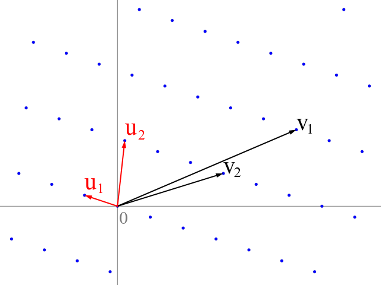

<script type="text/javascript" async
        src="https://cdn.jsdelivr.net/npm/mathjax@3/es5/tex-mml-chtml.js">
</script>


## Intro

Lattice attacks are a concept I encountered while participating in CTFs. For a long time, I avoided engaging with this concept because it seemed intimidating, and there were very few sources explaining it in a way that beginners could understand. The purpose of this post is to demonstrate how I interpreted a basic lattice attack and how I constructed it's lattice base.

### What is a Lattice?

A **lattice** is a given set of vectors with real coordinates, the lattice generated by these vectors consists of all possible integer linear combinations of the vectors.

$$L(\mathbf{b}_1, \mathbf{b}_2, \dots, \mathbf{b}_n) = \left\{ \sum_{i=1}^n z_i \mathbf{b}_i \mid z_i \in \mathbb{Z} \right\}$$



There’s a lot to cover, so this blog post from [Blupper](https://theblupper.github.io/blog/posts/lattices/) provides a good explanation of what a `Lattice` is and the concept of `Lattice Reduction`. Additionally, this [Giapppp](https://hackmd.io/@Giapppp/BJ4wfpZST) offers a clear understanding of the underlying problems related to Lattices (SVP, CVP, SIVP).

For practical exploration, a good starting point is the set of challenges on [Cryptohack](https://cryptohack.org/challenges/post-quantum/), which can help deepen your comprehension of the concept.


## Matrices

In order to construct a Lattice Basis, we need to understand how matrix multiplication works and how to express a mathematical equation as a Matrix Multiplication.


### Matrice Multiplication 

To multiply a matrix by another matrix, we need to perform the `dot product.` The `dot product` is where we multiply corresponding elements, then sum them up.

### Product as a weighted sum of columns


$$
Ax=
\begin{bmatrix}
\alpha_{11} & \alpha_{12} & \dots & \alpha_{1n} \\
\alpha_{21} & \alpha_{22} & \dots & \alpha_{2n} \\
 \vdots & \vdots &  \ddots & \vdots \\
\alpha_{n1} & \alpha_{n2} & \dots & \alpha_{mn} \\
\end{bmatrix}
\begin{pmatrix}
\textcolor{red}{x_1} \\ \textcolor{teal}{x_2}  \\ \vdots \\ \textcolor{orange}{x_n}
\end{pmatrix}
=
\begin{pmatrix}
\alpha_{11}\textcolor{red}{x_1} + \alpha_{12}\textcolor{teal}{x_2} + \dots + \alpha_{1n}\textcolor{orange}{x_n} \\
\alpha_{21}\textcolor{red}{x_1} + \alpha_{22}\textcolor{teal}{x_2} + \dots + \alpha_{2n}\textcolor{orange}{x_n} \\
  \vdots \\
\alpha_{m1}\textcolor{red}{x_1} + \alpha_{m2}\textcolor{teal}{x_2} + \dots + \alpha_{mn}\textcolor{orange}{x_n} \\
\end{pmatrix}
$$

<p style="text-align:center">Let’s say we are given the following two matrices:</p>


$$
\begin{bmatrix}
1 & 2 & 3 \\
4 & 5 & 6 \\
7 & 8 & 9
\end{bmatrix}
\times
\begin{pmatrix}
\textcolor{red}{10}    \\
\textcolor{teal}{20}    \\
\textcolor{orange}{30}
\end{pmatrix}
$$

<p style="text-align:center">Next, we multiply the matrices element-wise (dot product):</p>

$$
\begin{bmatrix}
1 \times \textcolor{red}{10} & 2 \times \textcolor{teal}{20} & 3 \times \textcolor{orange}{30} \\
4 \times \textcolor{red}{10} & 5 \times \textcolor{teal}{20} & 6 \times \textcolor{orange}{30} \\
7 \times \textcolor{red}{10} & 8 \times \textcolor{teal}{20} & 9 \times \textcolor{orange}{30}
\end{bmatrix}
$$

<p style="text-align:center">Simplifying the results:</p>

$$
\begin{bmatrix}
10 & 40  &  90 \\
40 & 100  & 180  \\
70 & 160  & 270 
\end{bmatrix}
=
\begin{bmatrix}
10 + 40  +  90 \\
40 + 100  + 180  \\
70 + 160  + 270 
\end{bmatrix}
=
\begin{pmatrix}
140 \\
320 \\
500
\end{pmatrix}
$$


### Product as a weighted sum of rows


$$
Ax=
\begin{pmatrix}
x_1 & x{2} & \cdots & x{n}
\end{pmatrix}
\begin{bmatrix}
\alpha_{11} & \alpha_{12} & \dots & \alpha_{1n} \\
\alpha_{21} & \alpha_{22} & \dots & \alpha_{2n} \\
 \vdots & \vdots &  \ddots & \vdots \\
\alpha_{n1} & \alpha_{n2} & \dots & \alpha_{mn} \\
\end{bmatrix}
=
\begin{pmatrix}
\alpha_{11}x_1 + \alpha_{12}x_1 + \dots + \alpha_{1n}x_1 \\
\alpha_{21}x_2 + \alpha_{22}x_2 + \dots + \alpha_{2n}x_2 \\
  \vdots \\
\alpha_{m1}x_n + \alpha_{m2}x_n + \dots + \alpha_{mn}x_n \\
\end{pmatrix}
$$

<p style="text-align:center">Let’s say we are given the following two matrices:</p>


$$
\begin{pmatrix}
\textcolor{red}{10}     &
\textcolor{teal}{20}    &
\textcolor{orange}{30}
\end{pmatrix}
\begin{bmatrix}
1 & 4 & 7 \\
2 & 5 & 8 \\
3 & 6 & 9
\end{bmatrix}
$$

<p style="text-align:center">Next, we multiply the matrices element-wise (dot product):</p>

$$
\begin{bmatrix}
1 \times \textcolor{red}{10}     & 4 \times  \textcolor{red}{10}     & 7 \times \textcolor{red}{10}     \\
2 \times \textcolor{teal}{20}    & 5 \times  \textcolor{teal}{20}    & 8 \times \textcolor{teal}{20}    \\
3 \times \textcolor{orange}{30} & 6 \times   \textcolor{orange}{30}  & 9 \times \textcolor{orange}{30}
\end{bmatrix}
$$

<p style="text-align:center">Simplifying the results:</p>

$$
\begin{bmatrix}
10    &40      & 70   \\
40    &100    &  160    \\
70 & 180  &      270
\end{bmatrix}
=
\begin{bmatrix}
10 + 40 +   70 &
40 + 100  + 180 &
70 + 160 +  270
\end{bmatrix}
=
\begin{pmatrix}
140 &
320 &
500
\end{pmatrix}
$$


<p style="text-align:justify;">For the CTF lattices, we will encounter only matrix multiplications of the form <b>[1×m]⋅[m×n]</b> since <b style="color:#336699">sage LLL</b> function with sum of rows.</p>


### Expressing a Mathematical Equation as a Matrix Multiplication

### Without Modulus

Let's assume we have the following system:

$$
\begin{aligned}
25 \alpha  - 23 \beta + 90\gamma + 33\delta  &= -45 \\
-67 \alpha  + 5 \beta + 3\gamma + 314\delta  &= 17 \\
2 \alpha  + 73 \beta + 46\gamma + 4\delta    &=  5  \\
32 \alpha  + 56 \beta - 34\gamma - 127\delta &= 1 \\
\end{aligned}
$$

Since we have 4 unknown, we will construct the system using a **[4×4]** matrix multiplied by **[4×1]** vector


$$
\begin{bmatrix}
 & & & &  \\
 & & & &  \\
 & & & &  \\
 & & & &  \\
 & & & &  \\
\end{bmatrix}
\begin{pmatrix}
  & \\
  & \\
  & \\
  & \\
  & \\
\end{pmatrix}
$$

First things firt, fill the [4×1] vector with the unknowns

$$
\begin{bmatrix}
 & & & &  \\
 & & & &  \\
 & & & &  \\
 & & & &  \\
 & & & &  \\
\end{bmatrix}
\begin{pmatrix}
  \alpha \\
  \beta \\
  \gamma \\
  \delta \\
\end{pmatrix}
$$

Then construct the [4×4] with the coefficients of variables according to matrix multiplication formula.

$$
\begin{bmatrix}
 25  &  -23 & 90  & 33  \\
 -67 &   5  & 3   & 314  \\
 2   &   73 & 46  & 4    \\
 32  &   56 & -34 & -34  \\

\end{bmatrix}
\begin{pmatrix}
  \alpha \\
  \beta \\
  \gamma \\
  \delta \\
\end{pmatrix}
$$

$$
\begin{bmatrix}
 25  \alpha&  -23 \beta& 90  \gamma& 33  \delta \\
 -67 \alpha&   5  \beta& 3   \gamma& 314 \delta \\
 2   \alpha&   73 \beta& 46  \gamma& 4   \delta \\
 32  \alpha&   56 \beta& -34 \gamma& -34 \delta \\
\end{bmatrix}
=
\begin{bmatrix}
25 \alpha  - 23 \beta + 90\gamma + 33\delta \\
-67 \alpha  + 5 \beta + 3\gamma + 314\delta \\
2 \alpha  + 73 \beta + 46\gamma + 4\delta \\
32 \alpha  + 56 \beta - 34\gamma - 127\delta \\
\end{bmatrix}
=
\begin{pmatrix}
-45 \\
 17 \\
  5 \\
  1 \\
\end{pmatrix}
$$


### With Modulus

We are solving the following system of congruences:

$$
\begin{aligned}
25 \alpha  - 23 \beta + 90 \gamma + 33 \delta &\equiv x \pmod{79}, \\
-67 \alpha  + 5 \beta + 3 \gamma + 314 \delta &\equiv y \pmod{79}, \\
2 \alpha  + 73 \beta + 46 \gamma + 4 \delta &\equiv z \pmod{79}, \\
32 \alpha  + 56 \beta - 34 \gamma - 127 \delta &\equiv w \pmod{79}.
\end{aligned}
$$

Using the property of modular arithmetic:

$$
a \equiv b \pmod{n} \iff a = b + k \cdot n \quad (k \in \mathbb{Z}),
$$

we can rewrite each equation as:

$$
\begin{aligned}
25 \alpha  - 23 \beta + 90 \gamma + 33 \delta - 79k_1 &= x, \\
-67 \alpha  + 5 \beta + 3 \gamma + 314 \delta - 79k_2 &= y, \\
2 \alpha  + 73 \beta + 46 \gamma + 4 \delta - 79k_3 &= z, \\
32 \alpha  + 56 \beta - 34 \gamma - 127 \delta - 79k_4 &= w.
\end{aligned}
$$

Now, we have 4 common unknowns ($\alpha, \beta, \gamma, \delta$) and 4 additional unknowns ($k_1, k_2, k_3, k_4$) that vary for each equation. To solve this system, we construct a **[4×8]** augmented matrix and a **[8×1]** vector of unknowns, following the matrix multiplication formula.

The matrices are structured as follows:

$$
\begin{bmatrix}
 & & & &  & & & & \\
 & & & &  & & & & \\
 & & & &  & & & & \\
 & & & &  & & & & \\
\end{bmatrix}
\begin{bmatrix}
  & \\
  & \\
  & \\
  & \\
  & \\
  & \\
  & \\
  & \\
\end{bmatrix}
$$

We begin with the **[8×1]** vector of unknowns:

$$
\begin{bmatrix}
  \alpha \\
  \beta \\
  \gamma \\
  \delta \\
  k_1 \\
  k_2 \\
  k_3 \\
  k_4 \\
\end{bmatrix}
$$

---

Next, we construct the first **[4×4]** matrix with the coefficients of the variables 

$$ \alpha, \beta, \gamma, \delta$$

$$
\begin{bmatrix}
  25  &  -23 & 90  & 33   & & & & \\
  -67 &   5  & 3   & 314  & & & & \\
  2   &   73 & 46  & 4    & & & & \\
  32  &   56 & -34 & -34  & & & & \\
\end{bmatrix}
\begin{bmatrix}
  \alpha \\
  \beta \\
  \gamma \\
  \delta \\
  k_1 \\
  k_2 \\
  k_3 \\
  k_4 \\
\end{bmatrix}
$$

---


To incorporate the variables $$k_1, k_2, k_3, k_4$$ , we add these variables in such a way that the first row corresponds to $$k_1$$, the second row to $$k_2$$, and so on. We use zeros in the places where  $$k_1, k_2, k_3, k_4$$ are not required. The resulting **[4×8]** matrix is:

$$
\begin{bmatrix}
  25  &  -23 & 90  & 33   & 79 &  0 &  0 &  0 \\
  -67 &   5  & 3   & 314  &  0 & 79 &  0 &  0 \\
   2  &   73 & 46  & 4    &  0 &  0 & 79 &  0 \\
  32  &   56 & -34 & -34  &  0 &  0 &  0 & 79 \\
\end{bmatrix}
\begin{bmatrix}
  \alpha \\
  \beta \\
  \gamma \\
  \delta \\
  k_1 \\
  k_2 \\
  k_3 \\
  k_4 \\
\end{bmatrix}
$$

---


When we multiply the matrix by the vector, the result is:

$$
\begin{bmatrix}
  25 \alpha - 23 \beta + 90 \gamma + 33 \delta + 79 k_1 \\
  -67 \alpha + 5 \beta + 3 \gamma + 314 \delta + 79 k_2 \\
   2 \alpha + 73 \beta + 46 \gamma + 4 \delta + 79 k_3 \\
  32 \alpha + 56 \beta - 34 \gamma - 34 \delta + 79 k_4 \\
\end{bmatrix}
=
\begin{bmatrix}
  x \\
  y\\
   z \\
  w \\
\end{bmatrix}
$$

### Connecting the Dots

In the following challenges, we will explore cryptographic schemes that are implemented insecurely. These vulnerabilities may allow us to recover secret values by using lattice-based techniques. 

We are given:

```python
from secret import y, m, N
from hashlib import sha256

flag = open("flag.txt", rb).read()

assert N.bit_length() == 1024
assert y.bit_length() == 100
assert m.bit_length() == 80

c = y*pow(m,-1,N) % N

assert "flag{" + sha256(str(y+m).encode()).hexdigest() + "}" == flag

print(c, N)
```
We are given `c`, `N`, and we want to retrieve `y` and `m` to get the flag. The relationship between these variables is described by the congruence:

$$
c \equiv y \cdot m^{-1} \pmod{N}
$$

Here, $$ y $$ and $$ m $$ are much smaller compared to $$ N $$. Our goal is to recover $$ y $$ and $$ m $$ . To achieve this, we want to transform the above equation to isolate $$ y $$. We proceed as follows:


We rewrite the congruence in terms of $$ y $$ by multiplying with $$ m $$:

$$
c \cdot m  \equiv y \cdot m^{-1}  \cdot m \pmod{N} 
$$

and we end up with

$$
\textcolor{cyan}{y} = c \cdot \textcolor{red}{m} + \textcolor{orange}{k} \cdot N
$$

where $$ k $$ is an integer accounting for the modulo operation.

Now, let's transorm the above equation to a product of matrices.

$$
\begin{pmatrix}
  \textcolor{red}{m} & \textcolor{orange}{k} 
\end{pmatrix}
\cdot
\begin{bmatrix}
  c  \\
  N
\end{bmatrix}
=
y 
$$

This is good enough to retrieve us `y` which we could later use to retrieve `m` as:

$$
m \equiv c \cdot y^{-1} \mod N
$$

However, we can modify the lattice basis in order to retrieve us both `y` and `m` by inserting the column [1,0]:

$$
\begin{pmatrix}
  \textcolor{red}{m} & \textcolor{orange}{k} 
\end{pmatrix}
\cdot
\begin{bmatrix}
  c  &  1 \\
  N  &  0 \\
\end{bmatrix}
$$


$$
\begin{pmatrix}
  c \cdot \textcolor{red}{m}  + N \cdot \textcolor{orange}{k} & 1 \cdot \textcolor{red}{m} + 0 \cdot \textcolor{orange}{k}  \\
\end{pmatrix}
=
\begin{pmatrix}
  \textcolor{cyan}{y} & \textcolor{red}{m}
\end{pmatrix}
$$


```python
from sage.all import *
from hashlib import sha256

"""
                    Equation
                  y = c*m + k*N

Lattice Basis   Multiplier Vector     Target Vector
   [c, 1]              
   [N, 0]            (m, k)              (y, m)         
"""

M = Matrix(ZZ,[[c, 1], [N, 0]])
print(M)
```
```cmd
[ 107373490097470206428135075788140401763513527924848265686679974272583011429183015398481161500464590745504544644681726486105102132150577436898004632539532869774547467840435976168587655276967961585036912782029400656601784545134140817946754877679741031768757008093741595483756524895139724169076110084563907523703    1 ]
[ 128399031764835953019540063964570287350980242976175542817781220622279664200781816719923292443891191202883306430966944389967809911138067300520386530056146884025443474523376874425156809941994950329035104353064857319628333753346712234998450109063835175602786543314822286034257961263570998688241417498520029555473    0 ]
```

### Lattice Basis and Target Vector

Our target vector is $$y, m $$, which is small compared to  $$N  $$. Using this lattice basis, we can apply the **Lenstra–Lenstra–Lovász (LLL)** algorithm.


The **LLL** algorithm does not directly find a specific short vector in the lattice. Instead, it reduces the lattice basis to produce vectors that are shorter and nearly orthogonal. 


```python
reduced = M.LLL()
print(reduced)
```
```cmd
[   -367673267242926996449019798367                                                                                                                                                                                                                                                                          -1206264264123871931525415                                                                                                                                                                                                                                                              ]
[   -1145724241231627677367430704302413996159881635870592657261324066406068047185929780950008738584177347158820500979501201001342341545801430023995021078710836180946458347032332168457392621796880803778110386125944864748553158190789359545682067614694923631482161674725691740362294                      349220471551495275173995178844913648896726851172092440862402546622968348891365486253917058424804053944726220732322718510677573709026057878275340326408397459849128374432231984434979107462196068309429079485589157327219352034125780535630081959697910163844571216756119347494642756489 ]
```

We can see that the first vector of the reduced basis contains two `100` bits and `80` bit values just like our targets `y` and `m`.

```python
for row in reduced:
  if abs(row[0]) * pow(abs(row[1]), -1, N) % N == c:
      y, m = abs(row[0]), abs(row[1])
      break

print("flag{" + sha256(str(y+m).encode()).hexdigest() + "}")
```


#### Why This Works

The LLL algorithm ensures that the lengths of the reduced basis vectors are bounded by:

$$
\|v\| \leq \left( \frac{2}{\sqrt{4\delta - 1}} \right)^{\frac{n-1}{2}} \text{DET}(L)^{\frac{1}{n}}
$$

where `u` is our target vector. Since, `u`  is a small enough vector to satisfy the above, LLL will find a linear combination of the lattice basis vectors that  will result to the small vector. This linear combination will be:

$$
y = c \cdot \textcolor{red}{m} + \textcolor{orange}{k} \cdot N
$$

$$
\textcolor{red}{m} \begin{pmatrix}
  c  &  1 
\end{pmatrix}
+
\textcolor{orange}{k}
\begin{pmatrix}
  N  &  0 
\end{pmatrix}
$$

which is basically

$$

\begin{pmatrix}
  \textcolor{red}{m} & \textcolor{orange}{k} 
\end{pmatrix}
\cdot
\begin{bmatrix}
  c  &  1 \\
  N  &  0 \\
\end{bmatrix}
=
\begin{pmatrix}
  y & m 
\end{pmatrix}
$$

## ECDSA Lattice Attack

The Elliptic Curve Digital Signature Algorithm (ECDSA) operates on an elliptic curve $$ E $$ defined over a finite field $$ \mathbb{F}_p $$, where $$ p $$ is a prime number. The elliptic curve is equipped with a generator with the same order $$n$$ as the curve.

A keypair in $$ E $$ consists of:
- A private key $$ d \in \mathbb{Z}_p $$, and
- A public key $$ P = d \cdot G \in E(\mathbb{F}_p) $$ where $$p$$ is a prime number.


### Signature Generation

To sign a message $$m$$ using a private key $$d$$, the following steps are performed:

1. **Select Random Value**: Choose a random integer $$k \in \mathbb{Z}_p$$.
2. **Compute Elliptic Curve Point**: Calculate the point $$(x, y) = k \cdot G$$ over the elliptic curve.
3. **Determine $$r$$**: Compute $$r = x \mod n$$. If $$r = 0 \mod n$$, return to step 1.
4. **Compute $$s$$**: Calculate $$s = k^{-1}(Hash(m) + r \cdot d) \mod n$$, where $$k^{-1}$$ is the modular inverse of $$k$$ modulo $$n$$.
5. **Output the Signature**: The signature for the message $$m$$ is $$(r, s)$$.

```python
from Crypto.Util.number import bytes_to_long
from hashlib import sha256
from random import randint
from sage.all import *

# Brainpool P-256-r1 #
p = 0xA9FB57DBA1EEA9BC3E660A909D838D726E3BF623D52620282013481D1F6E5377
a = 0x7D5A0975FC2C3057EEF67530417AFFE7FB8055C126DC5C6CE94A4B44F330B5D9
b = 0x26DC5C6CE94A4B44F330B5D9BBD77CBF958416295CF7E1CE6BCCDC18FF8C07B6
Gx = 0x8BD2AEB9CB7E57CB2C4B482FFC81B7AFB9DE27E1E3BD23C23A4453BD9ACE3262
Gy = 0x547EF835C3DAC4FD97F8461A14611DC9C27745132DED8E545C1D54C72F046997

E = EllipticCurve(GF(p), [a,b])
G = E(Gx, Gy)
n = 0xA9FB57DBA1EEA9BC3E660A909D838D718C397AA3B561A6F7901E0E82974856A7
####################
d = randint(1, n-1)
P = G*d

def sign(msg):
      h = bytes_to_long(sha256(msg).digest())
      k = randint(1, n-1)
      r = int((k*G)[0])
      s = int(pow(k, -1, n) * (h + d*r) % n)
    return ('r': r, 's': s)
```

The nonce $$k$$ must remain secret and used only once. If the same nonce is reused for the same private key $$d$$ across multiple signatures, the private key $$d$$ can be quickly recovered. Even if only a few bits of $$k$$ are known along with the corresponding signatures, a `latice attack` could recover the private key $$d$$. 

Assume the `sign` function leaks the **most significant bits** (MSB) of $$k$$. The function is implemented as follows:

```python
from hashlib import sha256
from random import randint
from Crypto.Util.number import bytes_to_long

def sign(msg):
    h = bytes_to_long(sha256(msg).digest())
    k = randint(1, n - 1)
    r = int((k * G)[0])
    s = int(pow(k, -1, n) * (h + d * r) % n)
    return {'r': r, 's': s, 'leak': k >> 76}
```

### Expressing the Leak Bits

For every requested signature, we know the $$256 - 76 = 180$$ **most significant bits** of $$k$$. Every number can be written as the sum of its MSB and LSB components:

$$
k = k_{\text{MSB}} \cdot 2^{\text{len}(k_{\text{LSB}})} + k_{\text{LSB}} 
$$

Where 2<sup>x</sup> is the expressed form of the bitwise operation `<<`


For example:

```python
# 11001011100000110100010111100001100100100111000100011011110110010110100110111001110 83 bits
number = 7688495639704534422080974

# 11001011100000110100010111100001100100100 41 bits
MSB =  number >> 42

# 11000100011011110110010110100110111001110 42 bits
LSB = number & (2**42 - 1)

# << operation makes space for X LSB bits and it's equivalent with multiplying  with a power of 2
# 11001011100000110100010111100001100100100000000000000000000000000000000000000000000
assert MSB << 42 == MSB * 2**42

# 11001011100000110100010111100001100100100 000000000000000000000000000000000000000000
# 00000000000000000000000000000000000000000 111000100011011110110010110100110111001110
# +----------------------------------------------------------------------------------
# 11001011100000110100010111100001100100100 111000100011011110110010110100110111001110
assert MSB * 2**42 + LSB == number
```

Given that we know the **180 MSB** of $$k$$, we can rewrite it as:

$$
k = k_{\text{MSB}} \cdot 2^{76} + k_{\text{LSB}}
$$

Substituting this into the original equation for the signature:

$$
S \equiv k^{-1} \cdot (HasHash(msg) + r \cdot d) \mod n
$$

We get:

$$
S \equiv (k_{\text{MSB}} \cdot 2^{76} + k_{\text{LSB}})^{-1} \cdot (HasHash(msg) + r \cdot d) \mod n
$$

### Hidden Number Problem

According to [Lattice Attacks against Weak ECDSA](https://eprint.iacr.org/2019/023.pdf), we can convert this equation to the **Hidden Number Problem (HNP):**


Start with the ECDSA equation:

$$
S \equiv (k_{\text{MSB}} \cdot 2^{76} + k_{\text{LSB}})^{-1} \cdot (Hash(msg) + r \cdot d) \mod n
$$

Multiply both sides by $$(k_{\text{MSB}} \cdot 2^{76} + k_{\text{LSB}})$$:

$$
S \cdot (k_{\text{MSB}} \cdot 2^{76} + k_{\text{LSB}}) \equiv h(\text{msg}) + r \cdot d \pmod{n}
$$

Rearrange:

$$
S \cdot (k_{\text{MSB}} \cdot 2^{76} + k_{\text{LSB}}) - h(\text{msg}) - r \cdot d \equiv 0 \pmod{n}
$$

Multiply both sides by $$S^{-1}$$:

$$
k_{\text{MSB}} \cdot 2^{76} + k_{\text{LSB}} - S^{-1} \cdot h(\text{msg}) - S^{-1} \cdot r \cdot d \equiv 0 \pmod{n}
$$

Rearrange further:

$$
k_{\text{LSB}} - S^{-1} \cdot r \cdot d + \left(k_{\text{MSB}} \cdot 2^{76} - S^{-1} \cdot h(\text{msg})\right) \equiv 0 \pmod{n}
$$

This equation can now be expressed in the form of the **Hidden Number Problem (HNP):**

Let:
- $$t_i = S^{-1} \cdot r$$
- $$a_i = k_{\text{MSB}} \cdot 2^{76} - S^{-1} \cdot h(\text{msg})$$


The equation becomes:

$$
k_{\text{LSB}} - t_i \cdot d + a_i \equiv 0 \pmod{n}
$$

```python
# k_LSB = t_i * d - a_i + q_i *p

# t_i = r * S^-1 % n
T = [x['r'] * pow(x['S'],-1,n) for x in sigs]

# a_i = [K_MSB * 2^76 -  S^-1 * Hash(m)] % n
A = [x['leak']*2**76  - pow(x['S'],-1,n) * x['Hash'] for x in sigs]
```


### Solving HNP with Lattice

According to the paper, for HNP to be solvable, the following condition must hold:

$$
\log_2(B) \leq \left\lfloor \frac{\log_2(p) \cdot (m - 1)}{m} - \frac{\log_2(m)}{2} \right\rfloor
$$

Where:
- $$B$$ is the known number of bits,
- $$p = \text{0xa9fb57dba1eea9bc3e660a909d838d726e3bf623d52620282013481d1f6e5377}$$,
- $$m$$ is the number of signatures.

For $$m = 4$$ signatures, the condition holds:

$$
\log_2(2^{180}) \leq \left\lfloor \frac{\log_2(p) \cdot (4 - 1)}{4} - \frac{\log_2(4)}{2} \right\rfloor
$$

$$
180  \leq \left\lfloor \frac{256 \cdot 3}{4} - 1 \right\rfloor
$$

$$
180 \leq 191
$$

Thus, we need at least **4 signatures** for the attack to work.

```python
from sage.all import *
from hashlib import sha256
from Crypto.Util.number import bytes_to_long

def sign(msg):
    h = bytes_to_long(sha256(msg).digest())
    k = randint(1, n - 1)
    r = int((k * G)[0])
    s = int(pow(k, -1, n) * (h + d * r) % n)
    return {'r': r, 'S': s, 'Hash': h ,'leak': k >> 76}


msgs = [
  b"Don't kill me, just help me run away",
  b'For everyone, I need a place to stay',
  b'Where I can cover up my face',
  b"Don't Cry, I am just a Freak ~ https://www.youtube.com/watch?v=NfMegACVJQw"
]

sigs = []
for msg in msgs:
  sigs.append(sign(msg))
```

---

### Constructing the Lattice Basis

The equation:

$$
k_{\text{LSB}} - t_i \cdot d + a_i \equiv 0 \pmod{n}
$$

can be rewritten as:

$$
k_{\text{LSB}} \equiv t_i \cdot d - a_i \pmod{n}
$$

or equivalently:

$$
\textcolor{cyan}{k_{\text{LSB}}}\equiv t_i \cdot \textcolor{red}{d} + a_i \cdot \textcolor{grey}{-1} + \textcolor{orange}{q_i} \cdot n
$$

The above equation can be expressed as:

$$
\begin{pmatrix}
  \textcolor{red}{d} &
  \textcolor{grey}{-1} &
  \textcolor{orange}{q_i} 
\end{pmatrix}
\begin{bmatrix}
  t_i \\
   a_i \\
  n 
\end{bmatrix}
$$


Where:
- $$\textcolor{red}{d}$$ (the private key) is the unknown, shared across all equations,
- $$a_i$$ has a coefficient of $$\textcolor{grey}{-1}$$,
- $$\textcolor{orange}{q_i}$$ is a unique integer for each equation.


Since we have 4 equations, we construct a lattice basis  as [$$1 \times 6$$]$$\cdot$$[$$6 \times 4$$] of our known variables $$t_i$$, $$a_i$$ and $$n$$ with a  multiplier vector of [ $$\textcolor{red}{d}$$, $$\textcolor{grey}{1}$$ ,  $$\textcolor{orange}{q_i}$$ ]

#### Lattice Basis


$$
\begin{pmatrix}
  \textcolor{red}{d} &
  \textcolor{grey}{-1} &
  \textcolor{orange}{q_1} &
  \textcolor{orange}{q_2} &
  \textcolor{orange}{q_3} &
  \textcolor{orange}{q_4} 
\end{pmatrix}

\begin{bmatrix}
  t_1  &  t_2 & t_3 &  t_4 \\
  a_1  &  a_2 & a_3 &  a_4 \\
  p  &  0 & 0 &  0 \\
  0  &  p & 0 &  0 \\
  0  &  0 & p &  0 \\
  0  &  0 & 0 &  p \\
\end{bmatrix}
=
\begin{pmatrix}
  \textcolor{cyan}{k_{\text{LSB}_1}} &
  \textcolor{cyan}{k_{\text{LSB}_2}} &
  \textcolor{cyan}{k_{\text{LSB}_3}} &&
  \textcolor{cyan}{k_{\text{LSB}_4}}  
\end{pmatrix}
$$

```python
M = Matrix([
   T,
   A,
   [n, 0, 0, 0],
   [0, n, 0, 0],
   [0, 0, n, 0],
   [0, 0, 0, n]
])

print(M)
```
```cmd
[  168191965138561344530883706581109669492069739282828634013577455804049020257291020614204983665940458312357943614467978215871931051341303850546858365123224  655424665064226412889826022744461438392402572746960864568187562743069440045531379811329639754895739199330069414909769436474741132324422661084220353976434   823517079013993391733330276059920373037242739190020890621726767907127550006496188782373108666665135083631274279078774596037954819640149423277880823024056  2221633667376489818834843925269789936242644751019398267904713252943219240856222812322691793905641043217372335458809189469739835940518398441295939295961176]
[-2296006684638177088381170750260355495821537446774054287065529455582984030744802001168844456174882149884834094825733648346299626132845584833308108935952469 -2590227957904417588767246225966957426124356383311918734776800213875840336258701559016668779336303376975676330835305658101522604667953601115144274918861144 -1829977380402661360925956110195873476894801319098033277828229942316279143938009844792740645933742615303246362388998502555096494131798096641576873124830720   -99341121851945018036580388905798320404153070536059475062861531769264321467294095851303643959406942072428586715718511977119802596784873166403491396815918]
[ 76884956397045344220809746629001649092737531784414529538755519063063536359079                                                                              0                                                                              0                                                                              0]
[                                                                             0  76884956397045344220809746629001649092737531784414529538755519063063536359079                                                                              0                                                                              0]
[                                                                             0                                                                              0  76884956397045344220809746629001649092737531784414529538755519063063536359079                                                                              0]
[                                                                             0                                                                              0                                                                              0  76884956397045344220809746629001649092737531784414529538755519063063536359079]
```

In the given Lattice Basis, the vector  

$$
\begin{pmatrix}
  \textcolor{cyan}{k_{\text{LSB}_1}} &
  \textcolor{cyan}{k_{\text{LSB}_2}} &
  \textcolor{cyan}{k_{\text{LSB}_3}} &&
  \textcolor{cyan}{k_{\text{LSB}_4}}  
\end{pmatrix}
$$

has values of $$76$$ bits which compared to the `256` bits of `n` is small enough for the **LLL** to include it in the reduce basis. Hence, **LLL** will find a linear combination of the basis vectors such as:

$$
\textcolor{red}{+d} \cdot 
\begin{pmatrix}
  t_1  &  t_2 & t_3 &  t_4
\end{pmatrix} \\
\textcolor{grey}{-1} \cdot 
\begin{pmatrix}
  a_1  &  a_2 & a_3 &  a_4
\end{pmatrix} \\
\textcolor{orange}{+q_1} \cdot 
\begin{pmatrix}
  p  &  0 & 0 &  0 
\end{pmatrix}\\
\textcolor{orange}{+q_2} \cdot 
\begin{pmatrix}
  0  &  p & 0 &  0
\end{pmatrix}\\
\textcolor{orange}{+q_3} \cdot 
\begin{pmatrix}
  0  &  0 & p &  0
\end{pmatrix}\\
\textcolor{orange}{+q_4} \cdot 
\begin{pmatrix}
  0  &  0 & 0 &  p
\end{pmatrix}
$$

That will result to the vector

$$
\begin{pmatrix}
  \textcolor{cyan}{k_{\text{LSB}_1}} &
  \textcolor{cyan}{k_{\text{LSB}_2}} &
  \textcolor{cyan}{k_{\text{LSB}_3}} &
  \textcolor{cyan}{k_{\text{LSB}_4}}  
\end{pmatrix}
$$

```python
r_basis = M.LLL()
print(r_basis)
```
```cmd
[                                            0                                             0                                             0                                             0]
[                                            0                                             0                                             0                                             0]
[                     -56039061852288304357217                      -17853788077389654140657                       -7214226679971455019718                      -36032384052598836284570]
[  4336406844166662309060727897252316623007428  12163373886364570330411589579764373176662757  26423357291300255136214563681658969303118869 -18061379430943547495542294038718408410317407]
[  8841986250775792038268699557879241000007952  28267897590172278826001599514848674822380102 -12786494996937547615429912131308422276164378 -25197916204961278453603690021417368714232575]
[-36317315456821500036599559973191777333029258  38787008282201682768966898248677825264062330  19909209053092463611430621879847837885759731  33277390479886067191899081925702438911296313]
```

The 3rd row is our target vector containing the $76$ bit $$k_{LSB_i}$$ values. We can recover private key $d$ as:


$$
k_0 = k_{\text{MSB}_0}*2^{76} + k_{\text{LSB}_0}
$$

$$
S_0 \equiv k_0^{-1} \cdot (Hash(msg_0) + r_0 \cdot d) \mod n
$$

multiply with $k$

$$
S_0 \cdot k_0 \equiv Hash(msg_0) + r_0 \cdot d \mod n
$$

Move $\text{HasHash(msg)}$

$$
S_0 \cdot k_0 - Hash(msg_0)\equiv r_0 \cdot d \mod n
$$

Multiply with $r$ inverse:

$$
[S_0 \cdot k_0 - Hash(msg_0)]\cdot r_0^{-1} \equiv d \mod n
$$

## Improved ECDSA Lattice Basis

In this improved lattice basis, we include the private key  $$ d  $$ in our target vector. To achieve this, we modify the basis by adding two extra columns:

 $$
 \begin{pmatrix}
  \textcolor{red}{d} &
  \textcolor{grey}{-1} &
  \textcolor{orange}{q_1} &
  \textcolor{orange}{q_2} &
  \textcolor{orange}{q_3} &
  \textcolor{orange}{q_4} 
\end{pmatrix}
\begin{bmatrix}
  t_1  &  t_2 & t_3 &  t_4 & \frac{1}{2^{256}} & 0 \\
  a_1  &  a_2 & a_3 &  a_4 & 0 & 2^{180} \\
  n  &  0 & 0 &  0 & 0 & 0 \\
  0  &  n & 0 &  0 & 0 & 0 \\
  0  &  0 & n &  0 & 0 & 0 \\
  0  &  0 & 0 &  n & 0 & 0 \\
\end{bmatrix}
 $$


$$
\begin{bmatrix}
  t_1\textcolor{red}{d}  &  t_2\textcolor{red}{d} & t_3\textcolor{red}{d} &  t_4\textcolor{red}{d} & \frac{1}{2^{256}}\textcolor{red}{d} & 0 \\
  -a_1  & - a_2  & -a_3 &  -a_4 & 0 & -2^{180} \\
  \textcolor{orange}{q_1}n  &  0 & 0 &  0 & 0 & 0 \\
  0  & \textcolor{orange}{q_2}n & 0 &  0 & 0 & 0 \\
  0  &  0 & \textcolor{orange}{q_3}n &  0 & 0 & 0 \\
  0  &  0 & 0 & \textcolor{orange}{q_4}n & 0 & 0 \\
\end{bmatrix}
\in Q 
 $$

The target vector for this basis is:

 $$
\begin{pmatrix}
  \textcolor{cyan}{k_{\text{LSB}_1}} & 
  \textcolor{cyan}{k_{\text{LSB}_2}} & 
  \textcolor{cyan}{k_{\text{LSB}_3}} & 
  \textcolor{cyan}{k_{\text{LSB}_4}} & 
  \frac{\textcolor{red}{d}}{2^{256}} & 
  -2^{180}
\end{pmatrix}
 $$

### Why Divide  $$ d  $$ by  $$ 2^{256}  $$?

The reason for adding  $$ \frac{1}{2^{256}}  $$ in the fifth column (instead of just  $$ 1  $$) is that the private key  $$ d  $$ is approximately 256 bits long. If the new column were simply:

 $$
\begin{pmatrix}
  1 \\
  0 \\
  0 \\
  0 \\
  0 \\
  0
\end{pmatrix}
 $$

then the corresponding target vector would be:

 $$
\begin{pmatrix}
  \textcolor{cyan}{k_{\text{LSB}_1}} & 
  \textcolor{cyan}{k_{\text{LSB}_2}} & 
  \textcolor{cyan}{k_{\text{LSB}_3}} & 
  \textcolor{cyan}{k_{\text{LSB}_4}} & 
  \textcolor{red}{d} & 
  -2^{180}
\end{pmatrix}
 $$

This vector would be significantly larger compared to the modulus  $$ n  $$. Consequently, the LLL algorithm would exclude our target vector when reducing the basis. By dividing  $$ d  $$ by  $$ 2^{256}  $$, we reduce its value to approximately  $$ 1  $$, making it small enough for the reduced bases to include our target vector. After recovering the target vector,  $$ d  $$ can be retrieved by multiplying it by  $$ 2^{256}  $$.

### The Purpose of the Last Column

The last column of the matrix is:

 $$
\begin{pmatrix}
  0 \\
  2^{180} \\
  0 \\
  0 \\
  0 \\
  0
\end{pmatrix}
 $$

This column serves to identify the target vector in the reduced basis. By appending a null column with a large constant, we can look for this constant after the reduction. If we find it, we can verify that we have recovered the target vector. 

Thus, the final target vector becomes:

 $$
\begin{pmatrix}
  \textcolor{cyan}{k_{\text{LSB}_1}} & 
  \textcolor{cyan}{k_{\text{LSB}_2}} & 
  \textcolor{cyan}{k_{\text{LSB}_3}} & 
  \textcolor{cyan}{k_{\text{LSB}_4}} & 
  \frac{\textcolor{red}{d}}{2^{256}} & 
  -2^{180}
\end{pmatrix}
 $$


```python
M = Matrix(QQ,[
   T + [QQ(1)/QQ(pow(2,256)), 0],
   A + [0, pow(2,180)],
   [n, 0, 0, 0, 0, 0],
   [0, n, 0, 0, 0, 0],
   [0, 0, n, 0, 0, 0],
   [0, 0, 0, n, 0, 0]
])

print(M)
```
```cmd
[ 1018305048724519322842934476927176980819441140472041855877481564068371063421625602490967187690818811893306262162040249356922929647009491281156660881173134   574881880849844663368030364742342105321952386942612611919968181643934378741151840510856250685988892244905882163023116616615722011609077854132184939066845  4166991329260270796044875543024068523586916706918682282117711272537512689656230147175832707984692123352948734006794887282819219681498225186775225632753474  2875749156159436168848792760105474595541258049232593198336341599434860762283598509432316734681884387672392324266694077951242839497839723717746800984292988                                                                            1                                                               115792089237316182568066630936767130765265951896062345822774554583111928119296                                                               0]
[-8651553035857115678425055126417621287633328001793197600622293565548332976645126314547135638850805283988436350402383146845761234356739089457947214410214858 -6198326301399118926104429069160364213225021742536507937378570421201275155883900170177404470088690869334951679067385071256123712067579712632247487150018756 -5398390147500113876603595491653195723095819409939539295282490281744555478720826219516484767299514339759790857508272015627424820832769511590376158429705600  -209237950198535268955826018802065567668772209054655919628911418321655737186069316721719050423450147973707400676448624192740503309265231969354689728048499                                                               0                                                               1532495540865888858358347027150309183618739122183602176]
[ 7688495639704534422080974662900164909273753178441452953875551906306353635907                                                                0                                                               0                                                               0                                                               0                                                               0]
[                                                                             0                                                               76884956397045344220809746629001649092737531784414529538755519063063536359079                                                               0                                                               0                                                               0                                                               0]
[                                                                             0                                                               0                                                               76884956397045344220809746629001649092737531784414529538755519063063536359079                                                               0                                                               0                                                               0]
[                                                                             0                                                               0                                                               0                                                               76884956397045344220809746629001649092737531784414529538755519063063536359079                                                               0                                                               0]
```
```python
r_basis = M.LLL()
print(r_basis)
```
```cmd
[ 0                                                               0                                                               0                                                               0                                                               -76884956397045344220809746629001649092737531784414529538755519063063536359079/115792089237316182568066630936767130765265951896062345822774554583111928119296                                                               0]
[ 62365005796253459160294                                                               37999433041420554141787                                                               34809435064684888736465                                                               67990067637960457816272     762347780017962405948160641602356350847821210789320473186601143556618888085/57896044618658091284033315468383565382632975948031172911387277291555964059648                                                               -1532495540865888858358347027150309183618739122183602176]
[ -888801978970723570118520021288469381519860075114325855150                                                               585428256440369564319936853141243633339322584406939965933                                                               -445854615614554808259474459181210551262341499448255289358                                                               -2539109820873930070440834882618908749465555165591124621822  23582657292708381595155755175233074528045931087307984910623586965649599546973/115792089237316182568066630936767130765265951896062345822774554583111928119296                                                               0]
[ -351326457465529869842354214586036222797565810796011254549                                                               2983120403286459574155852518581997006698325197139998556234                                                               -1283380986000933745095046364594758611658669948814382382846                                                               920250383171169649151087791760425443209540572338524691704                                                               17112336068108989629241587851390889669008958691258019573432086958591173706091/57896044618658091284033315468383565382632975948031172911387277291555964059648                                                               0]
[ 5250209462099674568453673843264510465114033590780991466844                                                               793672710832988707143315661149533099142595582988598329086                                                               -1684234354456799210520801963144065323724831586506002427513                                                               -1250842325090236401992363378575992472478318096864195910087                                                               22609520636449840667545692596777712989827607915377004064788122838320121534151/115792089237316182568066630936767130765265951896062345822774554583111928119296                                                               0]
[ -328855046487852005902855503344842992904539955925958759967                                                               4328126341613587451725840942039003499196016933824322343741                                                               7380108886703418159736544845216977823842217173666158530338                                                               771320437333896299738117994438290934909983209861710081619                                                               22083586464392703606333679840590848567504494761974353786821811616700268903323/115792089237316182568066630936767130765265951896062345822774554583111928119296                                                               0]
```

As we can see, second row is our target vector as it's last value is `2^180`.

```python
"""
Sometimes insted of [d, -1, q1, q2, q3, q4] we get [-d, 1, -q1, -q2, -q3, -q4] so we have to multiply with -1
We can verify that by checking the +- on the last value of our row
if it's `-2^180` we got the [d, -1, q1, q2, q3, q4] and we dont need to multiply
else we got [-d, 1, -q1, -q2, -q3, -q4] and we need to multiply -1
"""
for i in r_basis:
   if abs(i[-1]) == pow(2,180):
      if i[-1] <0:
         d = i[-2]*pow(2,256) % n
      else:
         d = -i[-2]*pow(2,256) % n      
print(d)
```


## Conclusion

When I started writing this post, I intended to cover other lattices and concepts, such as the Truncated LCG with HNP and LWE lattices. However, the post became lengthy enough as it was.
I might write about them in the future depending on the feedback and my mood. In any case, I hope this post serves as a good starting point and that you enjoyed reading it. :)

