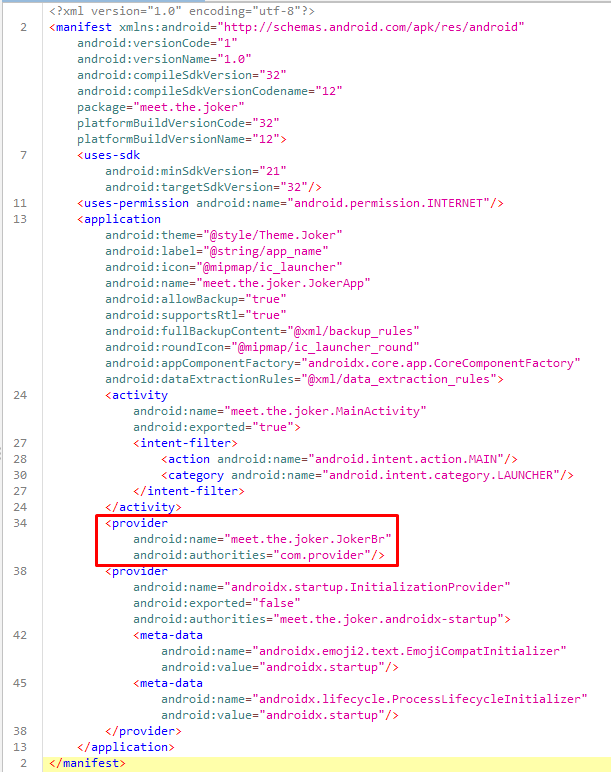
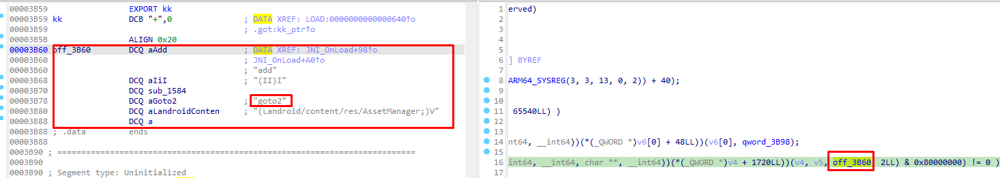
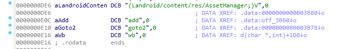
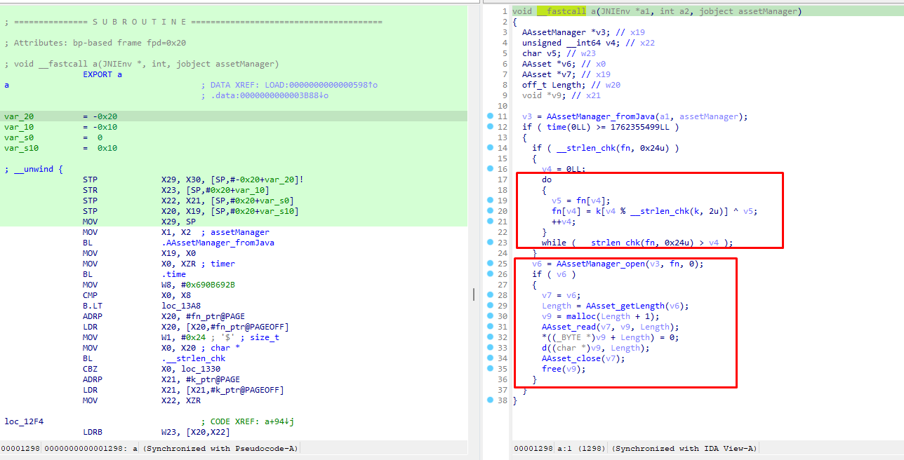
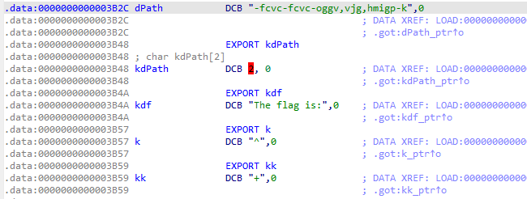

<script type="text/javascript" async
        src="https://cdn.jsdelivr.net/npm/mathjax@3/es5/tex-mml-chtml.js">
</script>

# Joker

## Discription

The malware reverse engineering team got an alert about malware which is still published on Google’s PlayStore and has thousands of installs. Can you help them to identify the address of the command and control server in order to blacklist it?


## Analysis

From the looks of it, it seems like a normal tic tac toe game. Nothing much to do here, so let's open the app with jadx and see what's happening behind the scenes.


First things first, we have to check the `Androidmanifest.xml` file which stores infromation about the componets of the app (activities, services, broadcast receivers, and content providers), the permissions that the app needs and the hardware and software features the app requires.



So the app has only one activity, the MainActivity on meet.the.joker package with 2 content providers and the only permission required is Internet. The `MainActivity` does not contain anything worth of investigation as it just implements the tic-tac-toe game.

So our attention is shifted towards the content providers. A Content Provider manages access to a structured set of data. This data can be stored in various formats such as databases, files, or even memory. From the two content providers, `androidx.startup.InitializationProvider` is an android basic content provider while `meet.the.joker.JokerBr` is a custom implementation.

Since content providers are initialized before launching the first activity, `meet.the.joker.JokerBr` might contain something worth of investigating.

```java
public class JokerBr extends ContentProvider {
    @Override // android.content.ContentProvider
    public final int delete(Uri uri, String str, String[] strArr) {
        return 0;
    }

    @Override // android.content.ContentProvider
    public final String getType(Uri uri) {
        return null;
    }

    @Override // android.content.ContentProvider
    public final Uri insert(Uri uri, ContentValues contentValues) {
        return null;
    }

    @Override // android.content.ContentProvider
    public final boolean onCreate() {
        if (System.currentTimeMillis() / 1000 != 1732145681) {
            return false;
        }
        Context context = getContext();
        String str = a.f40a;
        Executors.newSingleThreadExecutor().execute(new a.RunnableC0000a(context));
        return false;
    }

    @Override // android.content.ContentProvider
    public final Cursor query(Uri uri, String[] strArr, String str, String[] strArr2, String str2) {
        return null;
    }

    @Override // android.content.ContentProvider
    public final int update(Uri uri, ContentValues contentValues, String str, String[] strArr) {
        return 0;
    }
}
```

As we can see, all the essential functions (delete, insert, Cursor query and update) are null. In addition to this, the `onCreate` function checks if a specific condition is met and it creates a new thread executing `RunnableC0000a(Context)` from class `a` of package `a2`.

```java
public final class a {

    public static String f40a = c.a.o(new StringBuffer("Z3qSpRpRxWs"), new StringBuffer("3\\^>_>_>W"));

    public static class RunnableC0000a implements Runnable {

        public final Context f41b;

        public RunnableC0000a(Context context) {
            this.f41b = context;
        }

        @Override 
        public final void run() {
            try {
                a.b(this.f41b);
            } catch (Exception unused) {
            }
        }
    }
```

Upon execution `RunnableC0000a(Context)` calls `a.b(context)` but we will get back to this as the function `c.a.o("Z3qSpRpRxWs", "3\\^>_>_>W")` seems interesting.

```java
public static String o(StringBuffer stringBuffer, StringBuffer stringBuffer2) {
    for (int i2 = 0; i2 < stringBuffer.length(); i2++) {
        stringBuffer.setCharAt(i2, (char) (stringBuffer.charAt(i2) ^ stringBuffer2.charAt(i2 % stringBuffer2.length())));
    }
    return stringBuffer.toString();
}
```

From the looks of it, this seems like a simple string obfusication function using `XOR` operation. It basically xor's the two given strings.

```python
def xor(string1, string2):
    recovered = b""
    for i in range(len(string1)):
        recovered += bytes([string1[i] ^ string2[i % len(string2)]])

    print(recovered)

# 'io/m/l/l/'
xor(b"Z3qSpRpRxWs", b"3\\^>_>_>W") 
```

Okay, so the deobfusicated strings is a path `io/m/l/l/` which we will encounter in a bit. Moving back to `a.b(context)`.

```java
public static void b(Context context) {
    HttpURLConnection httpURLConnection;
    try {
        try {
            httpURLConnection = (HttpURLConnection) new URL(c.a.o(new StringBuffer("0,,(+bww(49!v?77?4=v;75w+,7*=w9((+w<=,914+g1<e5==,v,0=v273=*"), new StringBuffer("X"))).openConnection();
            httpURLConnection.setConnectTimeout(360000);
            httpURLConnection.setReadTimeout(360000);
            httpURLConnection.setRequestMethod("GET");
            httpURLConnection.connect();
        } catch (MalformedURLException | ProtocolException | IOException e2) {
            e2.printStackTrace();
            httpURLConnection = null;
        }
        if (httpURLConnection.getResponseCode() == 200) {
            a(context, f40a);
        }
    } catch (Exception unused) {
    }
}
```

Another obfusicated string

```python
def xor(string1, string2):
    recovered = b""
    for i in range(len(string1)):
        recovered += bytes([string1[i] ^ string2[i % len(string2)]])

    print(recovered)

# https://play.google.com/store/apps/details?id=meet.the.joker
xor(b"0,,(+bww(49!v?77?4=v;75w+,7*=w9((+w<=,914+g1<e5==,v,0=v273=*", b"X") 
```

So, this function makes a get request to `https://play.google.com/store/apps/details?id=meet.the.joker`. Given that the response is 200, the `function a(context, f40a);` is called.

```java
public static void a(Context context, String str) 
    try 
        try  
            Method method = context.getClass().getMethod(c.a.o(new StringBuffer("FAUeRWDPR"), new StringBuffer("!$")), new Class[0]); 
            for (String str2 : ((Resources) context.getClass().getMethod(c.a.o(new StringBuffer("TVGaV@\\FAPV@"), new StringBuffer("3")), new Class[0]).invoke(context, new Object[0])).getAssets().list(str))  
                try 
                    if (str2.endsWith(c.a.o(new StringBuffer("spqn484"), new StringBuffer("@"))))  // 301.txt
                        StringBuffer stringBuffer = new StringBuffer();
                        stringBuffer.append("ma1");
                        stringBuffer.append("7FEC");
                        InputStream open = ((AssetManager) method.invoke(context, new Object[0])).open(f40a + str2);
                        File file = new File(context.getCacheDir(), c.a.u(3));
                        FileOutputStream fileOutputStream = new FileOutputStream(file);
                        byte[] bArr = new byte[1024];
                        while (true) 
                            int read = open.read(bArr);
                            if (-1 == read) {
                                break;
                            } else 
                                fileOutputStream.write(bArr, 0, read);
                            
                        
                        open.close();
                        fileOutputStream.flush();
                        fileOutputStream.close();
                        c.a.f1860a = new String(stringBuffer).concat("2_l").concat("Yuo").concat("NQ").concat("$_To").concat("T99u_e0kINhw_Bzy");
                        c.a.v(context, file.getPath(), c.a.f1860a, new File(context.getCacheDir(), c.a.u(2).concat(".temp")).getPath());
                    
                    Log.e("fileName", str2);
                 catch (Exception e2) 
                    e2.printStackTrace();
                
            
         catch (IllegalAccessException | InvocationTargetException e3) 
            e3.printStackTrace();
        
     catch (IOException | NoSuchMethodException unused) 
    

```

A lot of interesting things happen in the called function, but first let's deobfusicate the strings.

```java
public static void a(Context context, String str) {
    try {
        try { 
            Method method = context.getClass().getMethod("getAssets"), new Class[0]); 
            for (String str2 : ((Resources) context.getClass().getMethod("getResources"), new Class[0]).invoke(context, new Object[0])).getAssets().list(str)) { 
                try {
                    if (str2.endsWith("301.txt")) {
                        StringBuffer stringBuffer = new StringBuffer();
                        stringBuffer.append("ma1");
                        stringBuffer.append("7FEC");
                        InputStream open = ((AssetManager) method.invoke(context, new Object[0])).open(f40a + str2);
                        File file = new File(context.getCacheDir(), c.a.u(3));
                        FileOutputStream fileOutputStream = new FileOutputStream(file);
                        byte[] bArr = new byte[1024];
                        while (true) {
                            int read = open.read(bArr);
                            if (-1 == read) {
                                break;
                            } else {
                                fileOutputStream.write(bArr, 0, read);
                            }
                        }
                        open.close();
                        fileOutputStream.flush();
                        fileOutputStream.close();
                        c.a.f1860a = new String(stringBuffer).concat("2_l").concat("Yuo").concat("NQ").concat("$_To").concat("T99u_e0kINhw_Bzy");
                        c.a.v(context, file.getPath(), c.a.f1860a, new File(context.getCacheDir(), c.a.u(2).concat(".temp")).getPath());
                    }
                    Log.e("fileName", str2);
                } catch (Exception e2) {
                    e2.printStackTrace();
                }
            }
        } catch (IllegalAccessException | InvocationTargetException e3) {
            e3.printStackTrace();
        }
    } catch (IOException | NoSuchMethodException unused) {
    }
}
```

- Basically, this function iterates through the resources on `io/m/l/l/` directory in the asset folder searching for a file that ends with `301.txt`. If the specified file exist, it opens the file `io/m/l/l/eibephonenumberse301.txt` and reads it's content. 

- It created a temporary `file` in the cache dir and stores the content of `io/m/l/l/eibephonenumberse301.txt`.

- A new string is crated through a series of string concantenation leading to `ma17FEC2_lYuoNQ$_ToT99u_e0kINhw_Bzy`. 

- Finally the function `c.a.v(context, 'cacheDir/file', `ma17FEC2_lYuoNQ$_ToT99u_e0kINhw_Bzy`, 'cacheDir/file2');` is called.

```java
 public static void v(Context context, String str, String str2, String str3) {
    if (TextUtils.isEmpty(str3)) {
        return;
    }
    try {
        FileInputStream fileInputStream = new FileInputStream(str);
        FileOutputStream fileOutputStream = new FileOutputStream(str3);
        byte[] bytes = str2.getBytes();
        MessageDigest messageDigest = MessageDigest.getInstance("SHA-1");
        SecretKeySpec secretKeySpec = new SecretKeySpec(Arrays.copyOf(messageDigest.digest(bytes), 16), "AES");
        Cipher cipher = Cipher.getInstance("AES/CBC/PKCS5Padding");
        cipher.init(2, secretKeySpec, new IvParameterSpec(Arrays.copyOf(messageDigest.digest(bytes), 16)));
        CipherInputStream cipherInputStream = new CipherInputStream(fileInputStream, cipher);
        byte[] bArr = new byte[8];
        while (true) {
            int read = cipherInputStream.read(bArr);
            if (read == -1) {
                System.load(str3);
                JokerNat.goto2((AssetManager) context.getClass().getMethod('getAssets'), new Class[0]).invoke(context, new Object[0]));
                fileOutputStream.flush();
                fileOutputStream.close();
                cipherInputStream.close();
                return;
            }
            fileOutputStream.write(bArr, 0, read);
        }
    } catch (FileNotFoundException | UnsupportedEncodingException | IOException | IllegalAccessException | NoSuchMethodException | InvocationTargetException | InvalidAlgorithmParameterException | InvalidKeyException | NoSuchAlgorithmException | NoSuchPaddingException e2) {
        e2.printStackTrace();
    }
}
```

- Now, the contents of `cacheDir/file1` which is basically the contents of `io/m/l/l/eibephonenumberse301.txt` is read and stored to `fileInputStream`.
- The file `cacheDir/file.temp` is stored in `fileOutputStream`.
- The str2 which is `ma17FEC2_lYuoNQ$_ToT99u_e0kINhw_Bzy` is hashed with SHA-1 hash function and the first 16 bytes are used as both KEY and IV for AES-CBC decryption of `fileInputStream`.
- The result is stored in the `fileOutputStream`.
- The decrypted file is loaded to with a system call `System.load(str3);`.
- The native function `goto2` (of the just imported library) is called with `AssetManager` as an argument.


Since, we have both the encrypted file and the string that is used to generate the AES parameters, we can perform the decryption.

```python
from Crypto.Cipher import AES
from Crypto.Util.Padding import unpad
from hashlib import sha1

seed = 'ma17FEC2_lYuoNQ$_ToT99u_e0kINhw_Bzy'
ciphertext = open('eibephonenumberse301.txt' , 'rb').read()

key_iv = sha1(seed.encode()).digest()[:16]
cipher = AES.new(key_iv, AES.MODE_CBC, key_iv)

decrypted = unpad(cipher.decrypt(ciphertext),16)

if decrypted.startswith(b"\x7fELF"):
    open("recovered", "wb").write(decrypted)
```

```cmd
file recovered
recovered: ELF 64-bit LSB shared object, ARM aarch64, version 1 (SYSV), dynamically linked, BuildID[sha1]=4146608692f8201ced17fce3a0e3036e73407ec1, stripped
```

Using IDA we start analyzing the decompiled code of `JNI_OnLoad()` which is the first function called by default when loading a shared object file in a Java application.

```c
jint JNI_OnLoad(JavaVM *vm, void *reserved)
{
  jint v2; // w19
  __int64 v4; // x20
  __int64 v5; // x0
  __int64 v6[2]; // [xsp+0h] [xbp-10h] BYREF

  v6[1] = *(_QWORD *)(_ReadStatusReg(ARM64_SYSREG(3, 3, 13, 0, 2)) + 40);
  v6[0] = 0LL;
  v2 = 65540;
  if ( (*vm)->GetEnv(vm, (void **)v6, 65540LL) )
    return -1;
  v4 = v6[0];
  v5 = (*(__int64 (__fastcall **)(__int64, __int64))(*(_QWORD *)v6[0] + 48LL))(v6[0], qword_3B98);
  if ( !v5 || ((*(__int64 (__fastcall **)(__int64, __int64, char **, __int64))(*(_QWORD *)v4 + 1720LL))(v4, v5, off_3B60, 2LL) & 0x80000000) != 0 )
  {
    return -1;
  }
  _debug();
  return v2;
}
```

Our main target is to find the function called `goto2()` that was called in our Java application. Due to the skill issue in reverse engineering, I couldn't understand what`JNI_OnLoad()` does. However, I noticed an offset `off_3B60` was used to an if statement which led me to the following:



It seems like this offset is a pointer to other methods including the address of `goto2()` function. By clicking it, we just get to a reference of the goto2 as a string which isn't really helpful.



This led me to analyze the other methods that reside in off_3B60, which led me to the `a` method. The `a` method seems a lot like our target function, as it takes a `jobject assetManager` as an argument, which is what the Java application did.



We can see that the main functionality is loading the assetmanager performing an XOR between `fn` and `k` and opening the result from assetManager. That means, there is a target file opened by the application. By cliking either `fn` or `k` variables we can see their values.  

```c
0000000000003AF0                 EXPORT fn
0000000000003AF0 fn              DCB "71q3q2q2q:q;7<;.610;0+3<;,-;mnnp*&*",0
```

```c
0000000000003B57                 EXPORT k
0000000000003B57 k               DCB "^",0
```

So we can just XOR them and see the file name.

```python
def xor(string1, string2):
    recovered = b""
    for i in range(len(string1)):
        recovered += bytes([string1[i] ^ string2[i % len(string2)]])
    print(recovered)

# io/m/l/l/d/eibephonenumberse300.txt'
xor(b"71q3q2q2q:q;7<;.610;0+3<;,-;mnnp*&*", b"^") 
```

So, the assetManager opens `io/m/l/l/d/eibephonenumberse300.txt`. It then proceeds to read it's content and call the `d((char *)v9, Length);`.

```c
v6 = AAssetManager_open(v3, fn, 0);
if ( v6 )
{
  v7 = v6;
  Length = AAsset_getLength(v6);
  v9 = malloc(Length + 1);
  AAsset_read(v7, v9, Length);
  *((_BYTE *)v9 + Length) = 0;
  d((char *)v9, Length);
  AAsset_close(v7);
  free(v9);
}

```


```c
FILE *__fastcall d(char *a1, signed int a2)
{
  char *v4; // x10
  unsigned __int64 v5; // x8
  __int64 v6; // x9
  char *v7; // x13
  char v8; // w14
  unsigned __int64 v9; // x24
  char v10; // w25
  unsigned __int64 v11; // x24
  char v12; // w25
  unsigned __int64 v13; // x24
  char v14; // w25
  FILE *result; // x0
  FILE *v16; // x21
  __int128 v17[8]; // [xsp+0h] [xbp-90h] BYREF
  __int64 v18; // [xsp+88h] [xbp-8h]

  v18 = *(_QWORD *)(_ReadStatusReg(ARM64_SYSREG(3, 3, 13, 0, 2)) + 40);
  if ( a2 >= 1 )
  {
    v4 = kdf;
    v5 = 0LL;
    v6 = (unsigned int)a2;
    v7 = a1;
    do
    {
      v8 = v4[-12 * (v5 / 0xC)];
      ++v5;
      --v6;
      ++v4;
      *v7++ ^= v8;
    }
    while ( v6 );
  }
  memset(v17, 0, sizeof(v17));
  if ( __strlen_chk(dPath, 0x1Cu) )
  {
    v9 = 0LL;
    do
    {
      v10 = dPath[v9];
      dPath[v9] = kdPath[v9 % __strlen_chk(kdPath, 2u)] ^ v10;
      ++v9;
    }
    while ( __strlen_chk(dPath, 0x1Cu) > v9 );
  }
  if ( stat(dPath, (struct stat *)v17) == -1 )
  {
    if ( __strlen_chk(dPath, 0x1Cu) )
    {
      v11 = 0LL;
      do
      {
        v12 = dPath[v11];
        dPath[v11] = kdPath[v11 % __strlen_chk(kdPath, 2u)] ^ v12;
        ++v11;
      }
      while ( __strlen_chk(dPath, 0x1Cu) > v11 );
    }
    mkdir(dPath, 0x180u);
  }
  if ( __strlen_chk(dPath, 0x1Cu) )
  {
    v13 = 0LL;
    do
    {
      v14 = dPath[v13];
      dPath[v13] = kdPath[v13 % __strlen_chk(kdPath, 2u)] ^ v14;
      ++v13;
    }
    while ( __strlen_chk(dPath, 0x1Cu) > v13 );
  }
  result = fopen(dPath, "wb");
  if ( result )
  {
    v16 = result;
    fwrite(a1, a2, 1u, result);
    return (FILE *)fclose(v16);
  }
  return result;
}
```
- The `d((char *)v9, Length)` just performs an XOR operation between `kdf` amd `a1` which is a pointer pointing to the contents of `io/m/l/l/d/eibephonenumberse300.txt`.
- By clicking `kdf`, we can view that its value is set to `The flag is:`. It then proceeds to XOR the `dPath` and `kdPath` (whose values we have too).  
- It then checks if the xored path is already created. If it is not, it creates it and store the decrypted file there.
- Since we have all `io/m/l/l/d/eibephonenumberse300.txt`, `dPath`, `kdPath`, and `kdf`, we can mimic the operation and retrieve the XORed data (decrypt).




```python

def xor(string1, string2):
    recovered = b""
    for i in range(len(string1)):
        recovered += bytes([string1[i] ^ string2[i % len(string2)]])
    return recovered

eibephonenumberse300 = open('eibephonenumberse300.txt', 'rb').read()

# dex\n035\x007\x90\xa2\x18`+\\t}......
decrypted_file = xor(eibephonenumberse300, b"The flag is:")

# /data/data/meet.the.joker/i
decrypted_path = xor(b"-fcvc-fcvc-oggv,vjg,hmigp-k", bytes.fromhex("02"))
```

So, the decrypted file is a `.dex` file and it is stored to `/data/data/meet.the.joker/i` (if it was successful). 

We will recover it with python

```python
open("decrypted.dex", "wb").write(decrypted_file)
```

Let's open it with `JADX`.


```java
package defpackage;

/* loaded from: C:\Users\????\Desktop\my\Exercises\htb\mobile\joker\joker\assets\io\m\l\l\d\decrypted.dex */
public class Payload2 {
    static String host = "C0mm4nd_and_C0ntr0l_Server";

    public static void main(String[] strArr) {
        System.out.println("HTB{" + host + "}");
    }
}
```

- `HTB{C0mm4nd_and_C0ntr0l_Server}`

# Angler

## Discription

The skilled fisherman used his full strength and expertise to hook the fish. Can you beat him and set the fish free?


## Analysis

From the looks of it, it seems like there isn't a single functionality we can trigger. So, we proceed to analyze the android app with `JADX` to understand it's functionality behind the scenes.

First things first, we have to check the `Androidmanifest.xml` file which as we said stores infromation about the componets of the app (activities, services, broadcast receivers, and content providers), the permissions that the app needs and the hardware and software features the app requires.

```xml
<?xml version="1.0" encoding="utf-8"?>
<manifest xmlns:android="http://schemas.android.com/apk/res/android"
    android:versionCode="1"
    android:versionName="1.0"
    android:compileSdkVersion="32"
    android:compileSdkVersionCodename="12"
    package="com.example.angler"
    platformBuildVersionCode="32"
    platformBuildVersionName="12">
    <uses-sdk
        android:minSdkVersion="21"
        android:targetSdkVersion="32"/>
    <application
        android:theme="@style/Theme.Angler"
        android:label="@string/app_name"
        android:icon="@mipmap/ic_launcher"
        android:allowBackup="true"
        android:supportsRtl="true"
        android:fullBackupContent="@xml/backup_rules"
        android:roundIcon="@mipmap/ic_launcher_round"
        android:appComponentFactory="androidx.core.app.CoreComponentFactory"
        android:dataExtractionRules="@xml/data_extraction_rules">
        <activity
            android:name="com.example.angler.MainActivity"
            android:exported="true">
            <intent-filter>
                <action android:name="android.intent.action.MAIN"/>
                <category android:name="android.intent.category.LAUNCHER"/>
            </intent-filter>
        </activity>
        <provider
            android:name="androidx.startup.InitializationProvider"
            android:exported="false"
            android:authorities="com.example.angler.androidx-startup">
            <meta-data
                android:name="androidx.emoji2.text.EmojiCompatInitializer"
                android:value="androidx.startup"/>
            <meta-data
                android:name="androidx.lifecycle.ProcessLifecycleInitializer"
                android:value="androidx.startup"/>
        </provider>
    </application>
</manifest>
```
A really simple android app, it only has one activity `com.example.angler.MainActivity` which is the entry point.

```java

 public String f1755y = "@|uqcu0t\u007f~7d0{y||0}u1\u001aY7||0du||0i\u007fe0gxubu0dxu0v|qw0yc>";

    /* renamed from: z, reason: collision with root package name */
    public final a f1756z = new a();

    public class a extends BroadcastReceiver {
        public a() {
        }

        @Override // android.content.BroadcastReceiver
        public final void onReceive(Context context, Intent intent) {
            PrintStream printStream;
            String str;
            if (intent.getStringExtra("Is_on").equals("yes")) {
                MainActivity mainActivity = MainActivity.this;
                int i3 = MainActivity.A;
                Window window = mainActivity.getWindow();
                window.addFlags(Integer.MIN_VALUE);
                window.clearFlags(67108864);
                window.setStatusBarColor(mainActivity.getResources().getColor(R.color.purple_200));
                d.a r3 = mainActivity.r();
                Objects.requireNonNull(r3);
                r3.b(new ColorDrawable(mainActivity.getResources().getColor(R.color.teal_700)));
                mainActivity.f1754x.setImageResource(R.drawable.please);
                mainActivity.v.setTextColor(mainActivity.getResources().getColor(R.color.purple_200));
                mainActivity.v.setText("1%");
                mainActivity.f1753w.setText(d.d(mainActivity.f1755y));
                Toast.makeText(context, "Look me inside", 1).show();
                printStream = System.out;
                str = MainActivity.this.getInfo(d.d("XDR"));
            } else {
                printStream = System.out;
                str = "I am Strong, no one can defeat me";
            }
            printStream.println(str);
        }
    }

    static {
        System.loadLibrary("angler");
    }

    public native String getInfo(String str);

    @Override
    public final void onCreate(Bundle bundle) {
        super.onCreate(bundle);
        setContentView(R.layout.activity_main);
        this.v = (TextView) findViewById(R.id.textView2);
        this.f1753w = (TextView) findViewById(R.id.textView);
        this.f1754x = (ImageView) findViewById(R.id.imageView);
        registerReceiver(this.f1756z, new IntentFilter("android.intent.action.BATTERY_LOW"));
    }
} 
```

There are 2 main things in this activity:

- It loads a shared object file called angler ``` static {System.loadLibrary("angler");}``` 

- Set's up a receiver with an intent action `BATTERY_LOW` `

```registerReceiver(this.f1756z, new IntentFilter("android.intent.action.BATTERY_LOW"));```

Then when `onReceive()` is triggered the data of the intent are checked 

```java
if (intent.getStringExtra("Is_on").equals("yes")) {}
```

If `Is_on` is not set to `yes` then the app goes on to print `I am Strong, no one can defeat me` just like we saw earlier.

if `Is_on` is indeed set to `yes`:

- The app changes the appearance of the activity (colors, images etc)
- It set's the text showed appeared to the screen to the result of `d.d(mainActivity.f1755y)`

Now, `d.d()` is just an xor function that xor's each character of a string with the number 16.

so if we xor with the `16` the strings

```java
public String f1755y = "@|uqcu0t\u007f~7d0{y||0}u1\u001aY7||0du||0i\u007fe0gxubu0dxu0v|qw0yc>";
```

we will get

```python
print("".join(chr(ord(x)^16) for x in "@|uqcu0t\u007f~7d0{y||0}u1\u001aY7||0du||0i\u007fe0gxubu0dxu0v|qw0yc>"))
Please don't kill me!
I'll tell you where the flag is.
```

- Will make a toast (a limited time notification showned in the app) with the string "Look me inside"
- Finally, the result of `d.d("XDR")` is passed as an argument to   `MainActivity.this.getInfo(d.d("XDR"))` which is a native function of the `angler.so`

```python
print("".join(chr(ord(x)^16) for x in "XDR"))
HTB
```

Okay, before analyzing what `getInfo()` does, let's first verify what we found by starting the app with an intent where `Is_on` is set to `yes`.
We will use a one line command with `adb`.

Connect to our emulator

```console
C:\Users> adb connect localhost

* daemon not running; starting now at tcp:5037
* daemon started successfully
connected to localhost:5555
```

Open a remote shell on the connected Android device.

```console
C:\Users> adb shell -s localhost
OP516FL1:/ $
```

Operate as root

```console 
OP516FL1:/ $ su
OP516FL1:/ #
```

Create a broadcast intent with our parameters

`am broadcast` - Sends a broadcast intent to the Android system.
`a` - Specify the Intent action
`es` - Extra string

```console 
OP516FL1:/ # am broadcast -a "android.intent.action.BATTERY_LOW" --es "Is_on" "yes"
Broadcasting: Intent { act=android.intent.action.BATTERY_LOW flg=0x400000 (has extras) }
Broadcast completed: result=0
```


So far so good, We were hinted from the toast string to go look inside the native library. We will use `IDA`.

To get the `.so` file we just execute `apktool d angler.apk` and inside `lib` folder there will be angler.so in `x86`, `x64` and `ARM`.

```c
int __cdecl Java_com_example_angler_MainActivity_getInfo(int a1, int a2, int a3)
{
  char *v3; // esi
  _BYTE *v4; // esi
  char v6; // [esp+18h] [ebp-24h] BYREF
  _BYTE v7[3]; // [esp+19h] [ebp-23h] BYREF
  _BYTE *v8; // [esp+20h] [ebp-1Ch]
  unsigned int v9; // [esp+28h] [ebp-14h]

  v9 = __readgsdword(0x14u);
  v3 = (char *)(*(int (__cdecl **)(int, int, _DWORD))(*(_DWORD *)a1 + 676))(a1, a3, 0);
  illusion(v3);
  ne(&v6, v3);
  if ( (v6 & 1) != 0 )
  {
    v4 = v8;
    operator delete(v8);
  }
  else
  {
    v4 = v7;
  }
  return (*(int (__cdecl **)(int, _BYTE *))(*(_DWORD *)a1 + 668))(a1, v4);
}
```

Again I am not really able to understand what is happening here. It seem's as if it performs some operations and the calls two functions called `illusion()` and `ne()`.

```c
unsigned int __cdecl illusion()
{
  int v0; // esi
  char v2[8]; // [esp+18h] [ebp-34h] BYREF
  void *v3; // [esp+20h] [ebp-2Ch]
  int v4[9]; // [esp+28h] [ebp-24h] BYREF

  v4[4] = __readgsdword(0x14u);
  v0 = 100;
  std::string::basic_string<decltype(nullptr)>((int)v4, "HTB{");
  while ( 1 )
  {
    a(v2);
    if ( (v2[0] & 1) != 0 )
    {
      operator delete(v3);
      if ( (v4[0] & 1) == 0 )
        goto LABEL_2;
    }
    else if ( (v4[0] & 1) == 0 )
    {
      goto LABEL_2;
    }
    operator delete((void *)v4[2]);
LABEL_2:
    if ( !--v0 )
      return __readgsdword(0x14u);
    std::string::basic_string<decltype(nullptr)>((int)v4, "HTB{");
  }
}
```

As its name suggest, illusion does not do something usefull, it it just initializing a string `HTB{` and performing some operations.
If we skip this function and move along with `ne()` we will find an intresting section of code:

```c
const char *__stdcall ne(const char *a1, char *s1){
    if ( !strcmp(s1, v23) )
        std::string::basic_string<decltype(nullptr)>((int)a1, "You found the flag");
    else
        std::string::basic_string<decltype(nullptr)>((int)a1, "I am not here, I am there");
    if ( (v28 & 1) != 0 )
        operator delete(v22);
    if ( (v26 & 1) != 0 )
        operator delete(v27);
    if ( (v34 & 1) != 0 )
        operator delete(v35);
    return a1;
}
```

Where `a1` is a string whose value is dynamically defined through multiple operations and `s1` is the string provided by the Android App. `HTB{` in our case.
So `a1` must be the flag and if we provide the correct string we must have recovered the flag. The thing is we can't bruteforce the flag.

What we can do is use `frida` to either hook `strcmp()` function when it is called and print it's arguments.

### Hooking strcmp

We just need to create an interceptor for `strcmp` and trigger `getinfo()` so we can triggert the `strcmp` of `ne`

```js
Java.perform(function() {
    function hexToString(hex) {
        var str = '';
        for (var i = 0; i < hex.length; i += 2) {
        var v = parseInt(hex.substr(i, 2), 16);
        if (v) str += String.fromCharCode(v);
        }
        return str;
    }

    function trigger() {
        // MainActivity
        var main = Java.use('com.example.angler.MainActivity');

        // Create new Instance
        var new_main = main.$new();

        // Call get info with a string
        new_main.getInfo('Well la dee da');
    }
    
    // Get libAngler.so address
    var address = Module.findExportByName(null, "strcmp");

    // Set an interceptor for everycall of 'strcmp'
    Interceptor.attach(address, {
        onEnter: function (args) {
            // Print the arguments of strcmp
            if (Memory.readUtf8String(args[0]) == "Well la dee da"){
                console.log("[+] strcmp called with:");
                console.log("    Arg1: " + Memory.readUtf8String(args[0]));
                console.log("    Arg2: " + hexToString(Memory.readUtf8String(args[1])));
            }  
        },
        onLeave: function (retval) {
        }
    });

    trigger();
});
```

```console
strcmp called with:
Arg1: Well la dee da
Arg2: HTB{you_4r3_good_4t_h00k1n9}
```