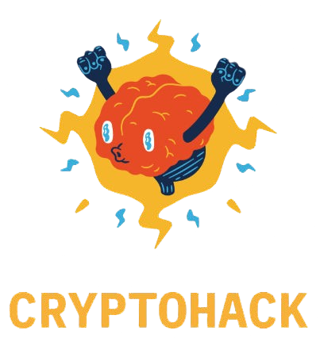

---
# the default layout is 'page'
icon: fas fa-info-circle
order: 6
---


<blockquote style="background-color: rgba(8, 12, 20, 0.98);; color: #00ff00; font-family: monospace; padding: 10px; border-radius: 5px;text-align:center;">
<span style="color: #0b59da;">eid3t1c@kali:~$</span> <span style="color: #3a5d97;">curl</span> <span style="color: #ffffff;">https://eid3t1c.github.io/whoami.js</span>
</blockquote>


```http
HTTP/1.1 200 OK
Date: Thu, 14 Nov 2024 18:00:00 GMT
Content-Type: application/javascript
Content-Length: 535
Connection: close

var me = {
    profile: {
        "handle": "eid3t1c",
        "studies": ["Computer Science", "Cybersecurity"],
        "age": 24,
        "languages": ["Greek", "Spanish", "English"],
        "location": "Hopefully one day Spain",
        "favorite series": ["Naruto", "Bojack Horseman", "HIMYM"]
    },
    interests: [
        "Active Directory",
        "Cryptography", 
        "Reverse Engineering", 
        "Digital Forensics",
        "Cybersecurity", 
        "Mobile"
    ],
    hobbies: ["CTF", "Stand Up Comedy", "Theater", "Psychology", "Beers"]
};
```
<div style="text-align:center">
<h2>Small Description</h2>

</div>

<p style="text-align:justify">
I'm a student who stumbled upon cybersecurity two years ago through a university course, and I’ve been hooked ever since. In February 2023 i started my journey in <span style="color:#e60000">cryptography</span>, diving into it for several months until it felt a bit boring. That's when I shifted to <span style="color:#0061b2">forensics</span> and <span style="color:#b96a05">reverse engineering</span>—two fields that both fascinating and very demanding.
</p>

<p style="text-align:justify">
After a year or so, CTFs began to feel more like a chore than a learning adventure. I decided it was time to take a break, focus on myself and my personal interests (touching grass), while staying connected to cybersecurity from a distance.
</p>

<p style="text-align:justify">
Fast-forward a few months: motivated once again, I’ve started to explore <span style="color:#119729">mobile security</span>, particularly .apk security
</p>


<p style="text-align:justify">
Currently, I am more focused in learning Active Directory and red teaming techniques. With this blog i am just looking to explore intresting topics and acquire technical skills and perhaps showcase some :). 
</p>


<br>

<table style="width: 100%; text-align: center;">
  <tr>
    <td></td>
    <td></td>
  </tr>
  <tr>
    <td><p><a href="https://cryptohack.org/user/alex_pa/">alex_pa</a></p></td>
    <td><p><a href="https://app.hackthebox.com/users/1306961">eid3t1c</a></p></td>
  </tr>
</table>


