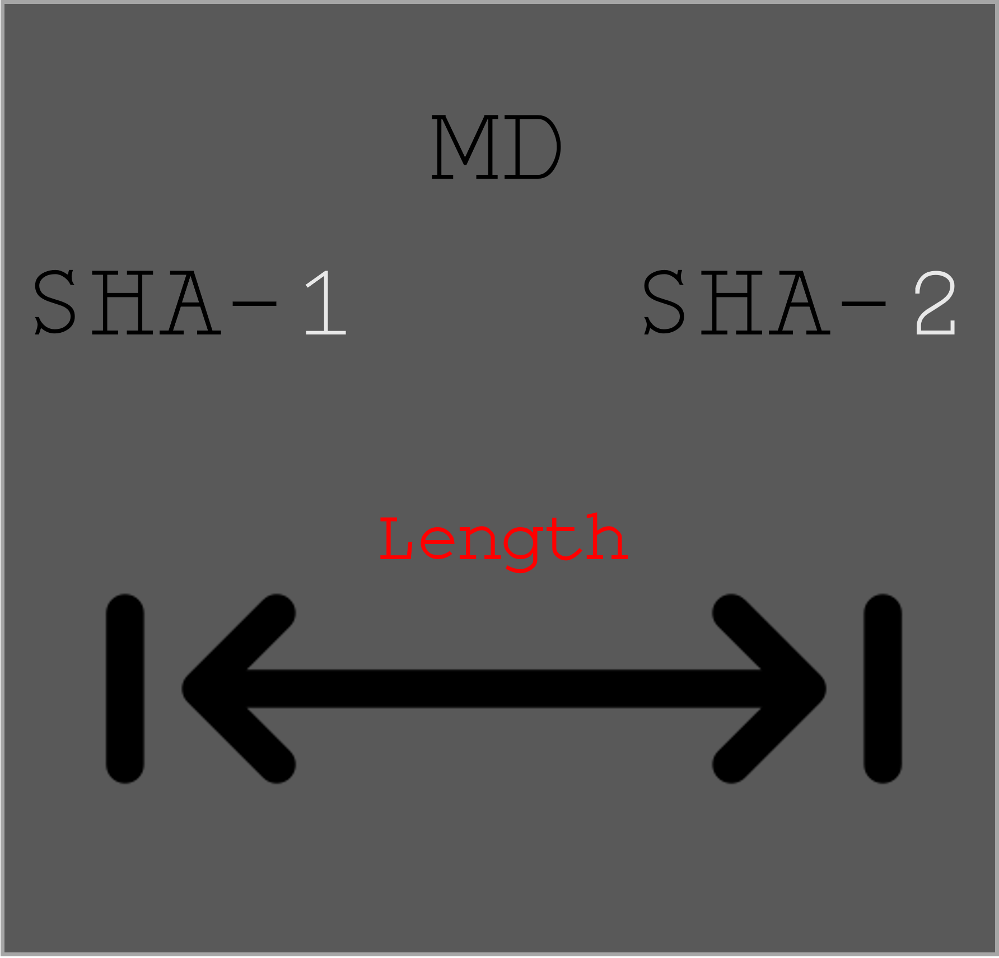
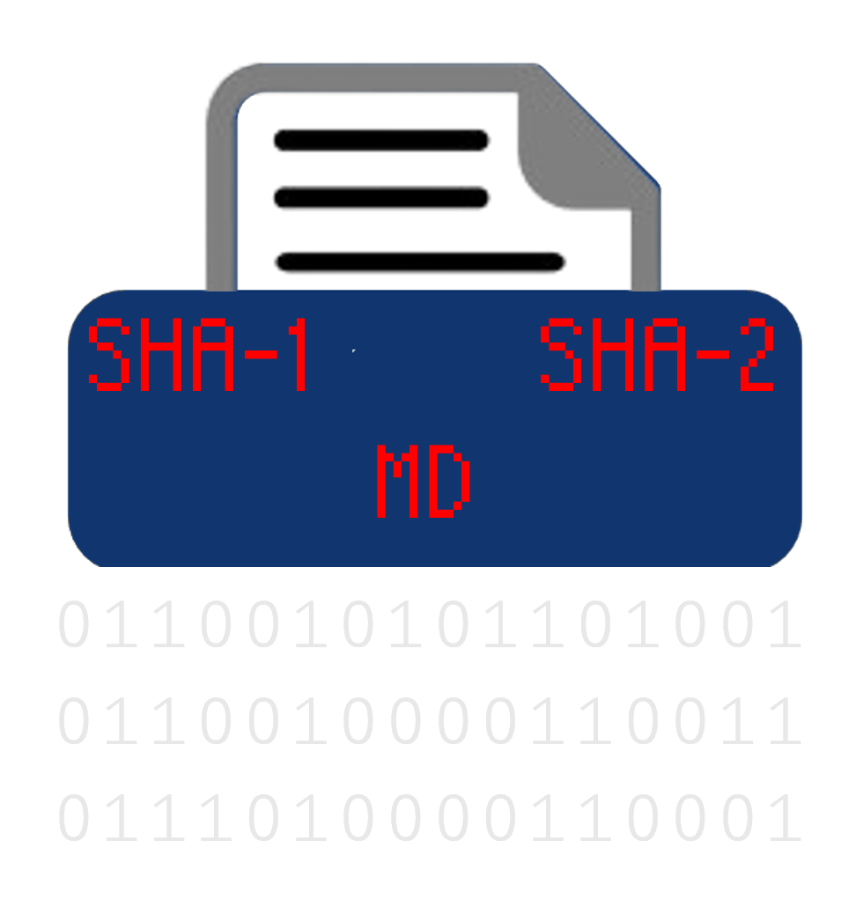
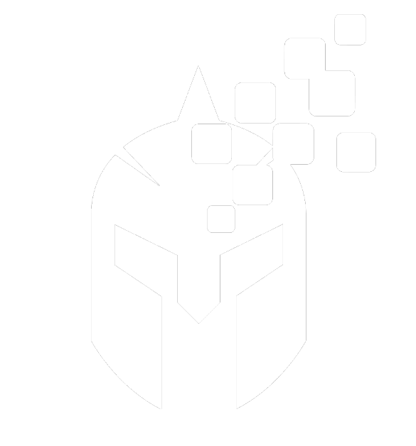

  

    
    <h2 style="margin: 10px 0; font-weight: bold;color:#095da7;font-family: monospace;"><b>Hash Length Extension tool</b></h2>
    
One of my first projects was an automated tool implementing the <b style="color:#b30000">Hash Length Extension</b> attack for <b style="color:#3366ff">SHA-1</b>, <b style="color:#3366ff">SHA-2</b>, and <b style="color:#3366ff">MD</b> families. I created it while learning how to manually implement such attack. It ain't much, but it's honest work🧑‍🌾.

     
    <a href="https://github.com/eid3t1c/Hash_Extender" target="_blank" style="display: inline-block; padding: 10px 20px; text-decoration: none; background-color: #007bff; color: white; border-radius: 5px; font-weight: bold;">View</a>
  

  

    
    <h2 style="margin: 10px 0; font-weight: bold;color:#095da7;font-family: monospace;"><b>HTB Main Platform CTF</b></h2>
    
What started as my first attempt to create a <b style="color:#e60000">crypto</b> CTF is now an active challenge on <b style="color:#00e600">Hack The Box</b>, titled "Infosekurus Query". It’s categorized as a Medium challenge, and the overall feedback has been mostly positive. Give it a try!

 

     
    <a href="https://app.hackthebox.com/challenges/infosekurus%20query" target="_blank" style="display: inline-block; padding: 10px 20px; text-decoration: none; background-color: #007bff; color: white; border-radius: 5px; font-weight: bold;">View</a>
  

  

    
    <h2 style="margin: 10px 0; font-weight: bold;color:#095da7;font-family: monospace;"><b>Hash Functions in Python</b></h2>
    
During a CTF, I needed an implementation of <b style="color:#3366ff">SHA-256</b> to experiment with its internal functions. Instead of using one from GitHub, I decided to implement my own after reading a couple of papers (later discovering there were YouTube videos :/). At the time, it felt like an accomplishment (despite being fairly easy), which eventually led me to implement all the <b style="color:#3366ff">SHA-1</b>, <b style="color:#3366ff">SHA-2</b>, and <b style="color:#3366ff">MD</b> families. Oh well, a project is a project, no matter its difficulty or uniqueness.
    

     
    <a href="https://github.com/eid3t1c/Hash_Functions_In_Python/tree/main" target="_blank" style="display: inline-block; padding: 10px 20px; text-decoration: none; background-color: #007bff; color: white; border-radius: 5px; font-weight: bold;">View</a>
  

  

    
    <h2 style="margin: 10px 0; font-weight: bold;color:#095da7;font-family: monospace;"><b>CTF Contribution at PCSC</b></h2>
    
<b>The Panhellenic Cybersecurity Student Competition</b> is a CTF event that has been running for the past two years, allowing all Greek students under 18 to participate. Its goal is to introduce them to cybersecurity through beginner-friendly challenges. Along with others, I contributed some challenges in Crypto, Forensics, and Reverse Engineering.

     
    <a href="https://github.com/UniPiSSL/pmdk-2024" target="_blank" style="display: inline-block; padding: 10px 20px; text-decoration: none; background-color: #007bff; color: white; border-radius: 5px; font-weight: bold;">View</a>
  

